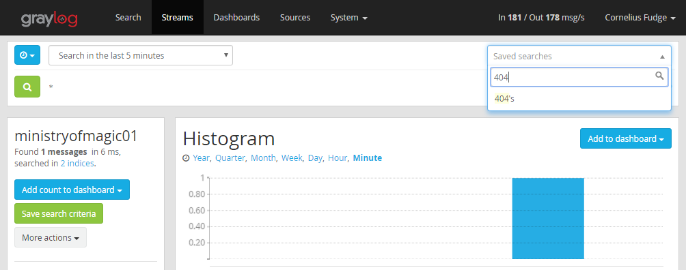

title: Dealing with 404s
summary: For when things are missing.
introduction: One of the most expensive requests on a SilverStripe site is the 404. Here are some common ways to avoid overloading your site with requests for things that aren't there.

## Common 404s
The [HTTP status code 404 NOT FOUND](https://httpstatuses.com/404) is used to represent a "file not found" error. This 
means that someone is trying to hit a URL that contains no content. There are a lot of reasons to receive a 404 - 
sometimes it's just a typo or a bot making a bad guess. Below are the most common reasons for a 404 on your CWP site 
that can be easily prevented:

### Legacy URLs

If you are migrating or rebuilding a site, there can be URLs from the original site that will no longer resolve once 
the site has been moved to CWP. For example, if the site `www.ministryofmagic.govt.nz` is migrated to CWP, and the 
news section has been renamed from `/news` to `/daily-prophet`, you may still have links, external or otherwise, 
that are pointing to the old URL. This problem can be especially severe just after launching the new site as search 
engine crawlers will check all of the old URLs they have to see if they've changed.

It's important to deal with legacy URLs, not only because it reduces needless server load, but because it will 
provide a better experience for your users. Links from bookmarks or other sites should still work even after 
you've updated your site. Forwarding legacy URLs will also help you maintain your search engine rankings that have 
been earned.

The best solution to this is to configure a permanent redirect in your `.htaccess` file - see 
[this guide](http://www.johnfdoherty.com/beginners-guide-to-the-htaccess-file/) for some good examples and explanations 
on the matter - and use [this simple tester](http://htaccess.mwl.be/) to make sure that it works they way you expect. If
instead the page is now gone, you can use `.htaccess` to return a [410 GONE](https://httpstatuses.com/410) response, 
or redirect to the homepage.

Your `.htaccess` file should live in the webroot - if you've used the 
[CWP Installer](https://www.cwp.govt.nz/developer-docs/en/getting_started/)
you should have one in your webroot already - you can just append the new configuration to the bottom. Alternatively, the
[Redirected URLs module](https://github.com/silverstripe/silverstripe-redirectedurls) can provide
similar redirect functionality from within the CMS.

Common culprits include `favicon.ico` and `/autodiscover/autodiscover.xml` - if you know where the request should go, 
you can configure a 301 redirect to the correct place; otherwise you can configure a 404 directly in the `.htaccess` 
file. This will mean the static 404 page will be served directly from the server, rather than being passed through to 
the SilverStripe Framework to work out that it is not there.

## Broken Links Report

Included in the CWP basic recipe is a [Reports module](https://github.com/silverstripe/silverstripe-reports), which 
contains a Broken Links report. This will show areas on your site where SilverStripe thinks that the URL contained is 
pointing to a missing resource.

## Monitor Your Logs

[Google Webmaster Tools](https://www.google.com/webmasters) is a useful resource for identifying 404s in your live 
site. Otherwise, you can use the server logs. If you don't already have access to Graylog, you can request access
through the [CWP Service Desk](https://www.cwp.govt.nz/service-desk/new-request/). Once there, you can use the dropdown 
to filter through your stream for 404 responses.

Once you have identified URLs that are pointing to resources that are missing, you can make an informed decision 
about how to deal with them - or whether they need to be dealt with at all.

