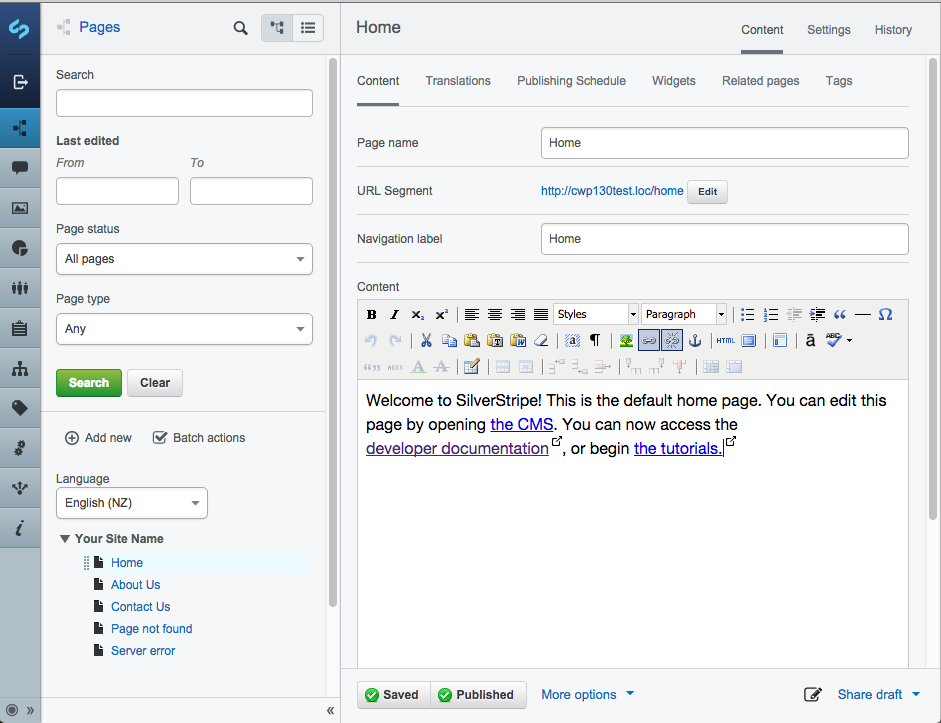

# CWP Recipe 1.3.0

## Overview

This recipe includes a new minor release of CMS and Framework to version 3.3.0.

Please see the changelogs for these following releases for the list of core changes since recipe 1.2.0

 * [framework 3.3.0](https://docs.silverstripe.org/en/3.3/changelogs/3.3.0/)

It is not mandatory that agencies upgrade to this release. In general, if you are unsure if you
need to upgrade to this release, it is safe to wait until your next scheduled upgrade cycle.

## New Features

The upgrade to CMS and Framework 3.3 introduces a major UX overhaul with improved handling
in the following areas:

- Ability to search pages in all edit views.
- Updated look and feel, with most elements receiving a theme overhaul.
- Additional security features to help construct and manage versioned DataObjects
- Additional security on the ?stage=Stage querystring parameter. Now by default, only users
    with any of the following permissions may set this option:
  - "Access to all CMS sections"
  - "Access to Pages section"
  - "View draft content"

For more information on how to prepare your existing code for compatibility with 3.3, please review
[the 3.3 changelog](https://docs.silverstripe.org/en/3.3/changelogs/3.3.0/) for specific upgrading instructions.

A description of the security features included in this release can be seen at
[ss-2015-019](http://www.silverstripe.org/download/security-releases/ss-2015-019).

## Note on issues on sites supporting large numbers of files

Additional documentation on how to improve performance in the asset admin has been added under
[Supporting large numbers of files](/how_tos/supporting_large_numbers_of_files)

## Upgrading Instructions

In order to update an existing site to use the new basic recipe the following changes to your composer.json
can be made:

	:::js
	"require": {
		"cwp/cwp-recipe-basic": "~1.3.0@stable",
		"cwp/cwp-recipe-blog": "~1.3.0@stable",
		"cwp-themes/default": "~1.2.1@stable"
	}

Note that the default theme has not been modified since recipe 1.2.0, and can be left unchanged.

## Details

### Enhancements

 * [OSS-798] - Unnessary title used on navigation
 * [OSS-777] - Improved UI for buttons and tabs
 * [OSS-651] - Improve filter notifications in page content view
 * [OSS-613] - CMS visual improvements
 * [OSS-612] - CMS three column layout

### Bugfixes

 * [OSS-1521] - Fix Subsites / SS 3.3 Template Issue
 * [CWP-574] - Hitting Memory Limit on Bulkloader with CSV file (CWP 7315)
 * [OSS-1362] - Fix accessibility regressions
 * [OSS-1513] - Fix treeview refresh on page navigation
 * [OSS-1514] - Fix versioned test global state problems
 * [OSS-1515] - Fix can't restore deleted pages issue
 * [OSS-1516] - Virtual Page permissions not saving

### Known issues

In recipe 1.3.0 there are the following known issues in these failing tests:

#### framework

 * FolderTest.testRenameFolderAndCheckTheFile - Known compatibility issue in versionedfiles
   with 3.2. See https://github.com/silverstripe-australia/silverstripe-versionedfiles/issues/43
 * FolderTest.testSetNameChangesFilesystemOnWrite - Known compatibility issue in versionedfiles
   with 3.2. See https://github.com/silverstripe-australia/silverstripe-versionedfiles/issues/43
 * FolderTest.testSetParentIDChangesFilesystemOnWrite - Known compatibility issue in versionedfiles
   with 3.2. See https://github.com/silverstripe-australia/silverstripe-versionedfiles/issues/43
   
#### userforms

 * UserFormsUpgradeServiceTest.testCustomSettingsMigration - Initial migration may sometimes fail
   to create the initial step. See https://github.com/silverstripe/silverstripe-userforms/issues/431

### Accepted failing tests

In recipe 1.3.0 these module unit tests cause external errors, but do not represent legitimate issues.

#### framework

 * UploadFieldTest.testAllowedExtensions — Behaviour intentionally altered by the MimeValidator module
 * UploadFieldTest.testSelect — Behaviour altered by SelectUploadField intentionally
 * UploadTest.testUploadTarGzFileTwiceAppendsNumber — This test is now expected
   to fail as the new MimeValidator module will no longer allow random content to
   be uploaded with a mismatched mime and file extension. The original test is
   attempting to upload a bunch of text as a gzip file.

#### queuedjobs

 * QueuedJobsTest.testImmediateQueuedJob - Test self-aborts when detecting lack of available system
   resources (inconclusive).
 * QueuedJobsTest.testStartJob - Test self-aborts when detecting lack of available system
   resources (inconclusive).

#### translatable

 * TranslatableSearchFormTest.testPublishedPagesMatchedByTitleInDefaultLanguage - Test failure
   affected by global state. See https://github.com/silverstripe/silverstripe-translatable/issues/223
 * TranslatableSiteConfigTest.testCanEditTranslatedRootPages - Test failure affected by global state.
   See https://github.com/silverstripe/silverstripe-translatable/issues/224
