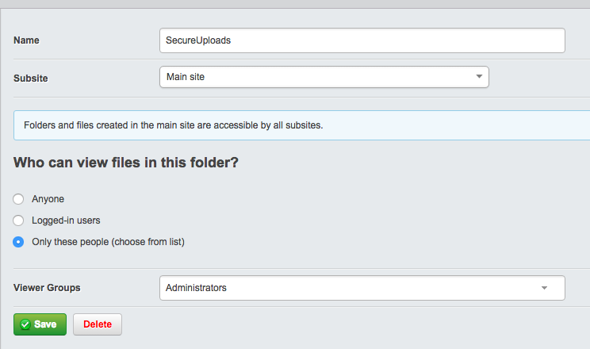

# CWP Recipe 1.1.1

## Overview

This release introduces many new features to UserForms, Solr, Full-text search and QueuedJobs modules.

This release also includes a security fix for the userforms module.

# Important: Medium-severity security vulnerability in Userforms

This release contains a fix for a security vulnerability in the
[userforms module](https://github.com/silverstripe/silverstripe-userforms),
which allows CMS administrators to create public facing forms with file upload abilities.

These files are uploaded into a predictable public path on the website, unless configured otherwise by the
CMS administrator setting up the form. While the name of the uploaded file itself is not predictable,
certain actions taken by CMS authors could expose it. For example, submission notification emails
contain a link to the file without authorisation checks.

## For users of recipe 1.1.1

In userforms 3.0.0 this field is disabled by default, but re-enabled upon installation of the
[secure assets module](https://github.com/silverstripe-labs/silverstripe-secureassets).
When this is installed, the field can once again be used within a form, and will automatically
lock this folder to a secure list of users, which can then be configured further by an administrator.

Existing file upload fields will not be disabled, but will require re-enabling via config or
installation of secure assets to become editable again.

If any upload field points or is pointed to a folder that is not secured, and the secure assets
module is present, then that folder will have the secure permissions applied automatically.

## For users of recipe 1.1.0

Any existing user form with a file upload field can be secured in recipe 1.1.0 by ensuring that
the selected folder of any such field is pointed to a secure folder location.

Then manually confirm that the selected folder is set to an appropriate level of access under the
"Files" cms section.

## New Features and Modules

Once you upgrade, the following features will be *automatically enabled*:

 * UserForms 3.0 has arrived. This module allows you to create forms through the CMS
   that meet web standards and can be easily styled. This version includes multi-page
   forms and nested field groups. There are many other new features, which you can find in the
   [module documentation](https://github.com/silverstripe/silverstripe-userforms/blob/master/docs/en/user-documentation.md).
   Additional security considerations around the protection of uploaded assets have been clarified in the
   [installation documentation](https://github.com/silverstripe/silverstripe-userforms/blob/master/docs/en/installation.md)
 * Content authors can now create
   [share links to draft changes](https://github.com/silverstripe-labs/silverstripe-sharedraftcontent/blob/master/docs/introduction.md), allowing better collaboration on draft content.
 * Full-text searching (pages and documents) now supports spelling suggestions. You
   can see a spelling suggestion example on [www.govt.nz](https://www.govt.nz/).
 * Search re-indexing now happens incrementally, and can now be queued. New re-index
   jobs will cancel running ones, leading to faster, and more robust indexing overall.
   You can read more about the performance improvements we have made in the
   [module documentation](../02_Features/solr_search#performance-implications-and-limitations).
 * QueuedJobs module has be greatly improved to be more stable and efficient. When enabled,
   jobs can now be executed in parallel processes. Failing parallel process jobs can no longer block the queue.

The following features will *require some additional work* in addition to the upgrade to enable them:

 * Full-text searching can support synonyms with some configuration by a back-end developer. Once this is
   complete, a content author will need to define appropriate synonyms for your site. Both steps are detailed in the
   [module documentation](../02_Features/solr_search#search-term-synonyms).
 * Full-text search can support boosting with some configuration by a back-end developer. Once this
   is complete, content authors can mark certain pages as top-ranking results for specific pages in
   the CMS. Both steps are detailed in the [module documentation](../02_Features/solr_search#boosting-results).

## Upgrading Instructions

In order to update an existing site to use the new basic recipe the following changes to your composer.json
can be made:

	:::js
	"require": {
		"cwp/cwp-recipe-basic": "~1.1.1@stable",
		"cwp/cwp-recipe-blog": "~1.1.1@stable",
		"cwp-themes/default": "~1.1.2@stable"
	}

Although upgrading to the recipe version 1.1.1 is intended to automatically work with existing code and content,
in certain situations manual changes may be necessary for projects on a case by case basis. This will normally be
the case where cwp or module components (such as classes or templates) have been customised.

This is a backend development process, and will require your development team to perform an upgrade to the new
recipe, as well as deploying to your staging environment to verify the successful upgrade of site
code and content.

## Details

### Bugfixes

 * [OSS-650] - Non-admins using a future PublishDate throws an error in certain cases
 * [OSS-652] - Links to comment moderation links are broken
 * [OSS-667] - Share link is broken in preview mode
 * [OSS-854] - UserDefinedFormField -> HeadingField, Period in Title breaks CSV export
 * [CWP-644] - Unstyled error pages
 * [CWP-643] - Missing action handler leaks class name
 * [CWP-642] - Potential Log Entry Manipulation
 * [CWP-641] - Unescaped string interpolation in SQL

### Features

 * [OSS-574, OSS-577, OSS-580, OSS-615, OSS-704, OSS-735, OSS-803, OSS-828] - Released UserForms 3.0
 * [OSS-178, ORB-106] - Extended Solr search options: synonyms
 * [OSS-644, ORB-106] - Extended Solr search options: boosting
 * [OSS-573, ORB-106] - Extended Solr search options: misspellings
 * [OSS-530] - Extended Solr search: queueable re-index
 * [OSS-528] - Extended QueuedJobs: processor usage control
 * [OSS-527] - Extended QueuedJobs: reliable execution

### Accepted failing tests

#### framework

 * ControllerTest.testRedirectBackByBackUrl - Error caused by invalid test, resolved in a future release.
 * ControllerTest.testRedirectBackByReferer - Error caused by invalid test, resolved in a future release.
 * DirectorTest.testAlternativeBaseURL - Test passes locally when run in isolation.
 * CMSProfileControllerTest.testMemberCantEditAnother — Problem with
 Requirements combining the same file twice, non-critical Framework issue.
 * UploadTest.testUploadTarGzFileTwiceAppendsNumber — This test is now expected
 to fail as the new MimeValidator module will no longer allow random content to
 be uploaded with a mismatched mime and file extension. The original test is
 attempting to upload a bunch of text as a gzip file.
 * i18nTextCollectorTest.testCollectFromThemesTemplates — Caused by global
 state, passes locally when the test is run individually.
 * RequirementsTest.testCommentedOutScriptTagIsIgnored - Test passes locally
 when run in isolation.

#### cms

 * CMSMainTest.testCreationOfRestrictedPage — Problem with Requirements
 combining the same file twice. Non-critical Framework issue.

#### queuedjobs

 * QueuedJobsTest.testStartJob — Caused by global state, passes locally when
 the test is run individually.
 * QueuedJobsTest.testImmediateQueuedJob — Caused by global state, passes
 locally when run either individually or as a part of all queuedjobs tests.
