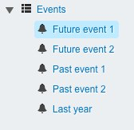
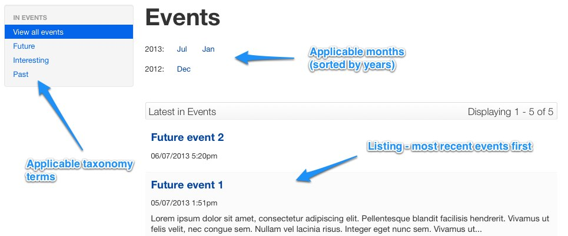

# News and events

## Events

You can create specialised pages to allow website visitors to view individual events (**Event Pages**) and event
listings (**Event Holders**).

To create a page to display information for an event, add a new page of the type **Event Page**. In addition to the
fields available on other pages, this page type allows you to specify the date and time of the event. These
details will be displayed on the template along with any taxonomy terms you associate with the page. For more
information see the [taxonomy page](taxonomy).

The events must be listed in a structured way to allow visitors to easily browse them. This is acheived with an **Event
Holder** which contains the **Event Pages**. Any number of **Event Holders** can be created, each with its own set of
events.

The events listing for the above events holder and pages is shown below and includes the following features:

* Events are sorted by date, descending (most recent on the top).
* Sidebar shows the taxonomy terms associated with underlying events.
* Months (and years) for which events are scheduled can be navigated.

## News

You can create **News Pages** and **News Holder** pages in a similar way to the event pages described above. The
differences are:

 * **NewsPage** has an *Author* field. This is displayed on the listing page and the news page.
 * **NewsPage** has a *Featured Image* field. This is displayed as a thumbnail on the listing page and on the top right
of the news page.
 * **NewsPage** doesn't have *Start Time*, *End Time* or *Location* fields.

The front-end navigation is handled in exactly the same way.