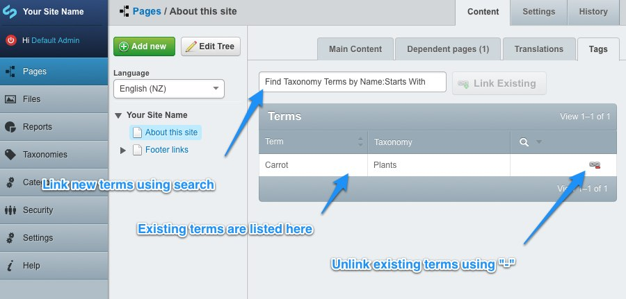

# Taxonomy

The taxonomy module allows you to create heirarchical sets of tags that you can apply to content within your site. This
allows users to find relevant content more easily.

Documentation on managing taxonomy terms is available in the [taxonomies module](../../../taxonomy/en).

## Adding taxonomy terms to a page

Taxonomy terms previously created in the Taxonomy section of the CMS can be added to pages from the *Tags* tab.
Type the first few characters of the desired term into the search field and select the term from the search
results displayed below the search field. Click the *Link Existing* button to add the term to the page and save
when all desired terms have been added.

The terms can only be linked and unlinked from the page from this tab - the taxonomy data and structure
cannot be changed through this interface. See the [module documentation](../../../taxonomy/en) for information on how
to build the taxonomy.