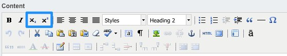
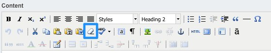
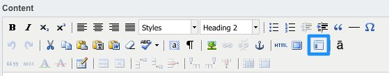
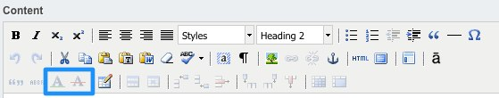

# Text editor options

The majority of the content on the website is edited by using the rich text editor (by default this is TinyMCE). Most
of the features of the editor are detailed in the "Formatting content" section of the 
[creating and editing content](http://userhelp.silverstripe.org/for-website-content-editors/creating-and-editing-content/)
page of the [SilverStripe User Help](http://3.0.userhelp.silverstripe.org/) site, however a number of features have
been added for CWP.

## Subscript and superscript

Use the subscript and superscript buttons when you wish to add footnotes. Note that this text can also be linked,
potentially to an anchor at the bottom of the page containing the actual footnote.

## Remove formatting

Use the remove formatting button to remove formatting from the selected text. This doesn't remove structural
formatting (eg heading levels, paragraphs), only visual formatting (eg bold, italic).

## Add template

Add pre-existing templates of content by clicking on the template button. The CWP default site doesn't come with
templates, but you can ask your development agency to set up templates for you to use.

## Citation and abbreviation

The citation and abbreviation buttons work in exactly the same way but for slightly different effect. By selecting
text and then clicking on them you will be able to enter in a citation or abbreviation explanation. Type the explanation
in the "Title" field and click on "Insert" - when the user hovers over the text on the website they will get a small
popup displaying the text you entered. There will usually be an indication to the user that this information is
available, dependent on the way your development agency has built your site.

## Insert and delete

The insertion and deletion buttons give you the capability to show to the user that certain text has been inserted or
deleted. Select the text that you wish to highlight and click the relevant button. A popup will come up that will allow
you to specify some optional parameters. Click *Update* to proceed.

To remove the insertion or deletion markup, position the cursor within the word and press the relevant editor button.
You will then be able to press the *Remove* button to remove the markup.