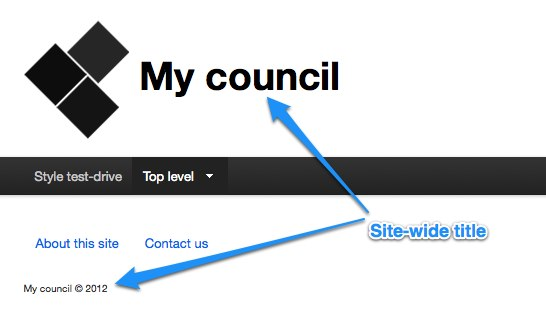
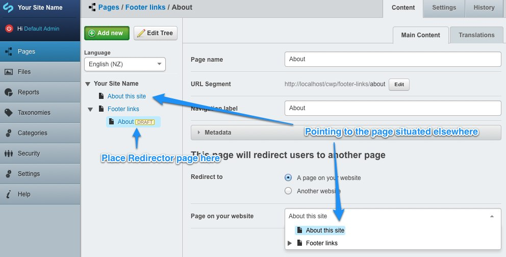
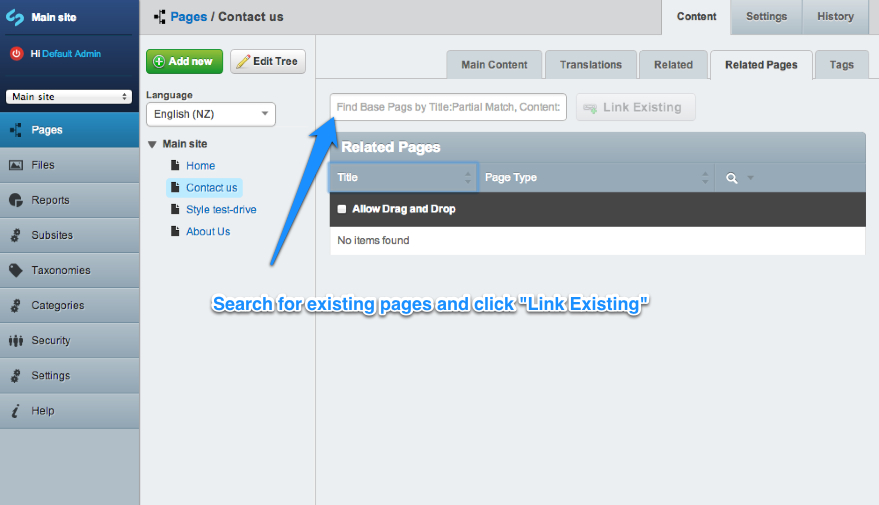

# Theme customisation

CWP comes with a basic theme ready to use. There are many ways to customise the way your site looks without having to
get developers or designers to build a new theme for you, and these are detailed below.

Please note that if you have got a new theme then some of these options may not function as described unless your
developer has built in support to your new theme.

## Site title

The site-wide title can be configured through *Settings* section, *Main* subsection in the CMS - enter the title in the
*Site title* field, and press *Save*. 

This change will affect several areas in the site, but specifics depend on the template used. Default template will
display the title in the header area, in the footer copyright and in the page title.

Note: *Site Tagline/Slogan* field is not used in the default template.

## Logos

With the default CWP theme two default logos are shown:

* An organisation logo in the top left, next to the site name.
* The newzealand.govt.nz logo in the bottom right.

These can be changed as follows:

* Open the CMS, and proceed to the *Settings* section, *Logos/Icons* tab.
* Customise the organisation logo by attaching an image to the *Logo, to appear in the top left.*
* Replace the "newzealand.govt.nz" logo by attaching an image to the *Footer logo, to appear in the bottom right.*
  * Set a custom link by filling the *Footer Logo link* field.
  * Set an accessibility description (that will propagate to "title" and "alt" attributes) by filling the *Footer Logo
  description* field.
* Press *Save*.

The logos aren't automatically resized, so make sure they are exactly the size you'd like them to appear before
uploading them.

## Social media and sharing

You can add a link to your organisation's Facebook page by following these steps:

 1. Visit your Facebook page
 1. Copy the parts of the URL that appear after 'facebook.com' So, if your URL was
http://www.facebook.com/visitnewzealand, copy 'visitnewzealand'.
If it was http://www.facebook.com/profile.php?id=12635800428, then copy 'profile.php?id=12635800428'
 1. Open the CMS, and proceed to the Settings section
 1. Open the 'Social Media' tab
 1. Paste the copied part of the URL into the `Facebook UID or username` field
 1. Save the settings

In a similar way, you can add a link to your organisation's Twitter account:

 1. Open the CMS, and proceed to the Settings section
 1. Open the 'Social Media' tab
 1. Enter your Twitter username into the `Twitter username` field
 1. Save the settings

When using the default theme, these two options will add linked icons in the bottom right of each page.

You can also let your site visitors share pages on your site through their own social networks by setting up AddThis.
To do this:

 1. If you don't have an AddThis account already, set one up by visiting [http://addthis.com/](http://addthis.com/) and
clicking on *Create Account* and following the sign-up process.
 1. Open the CMS, and proceed to the *Settings* section
 1. Open the *Social Media* tab
 1. Enter your AddThis profile ID into the *AddThis Profile Id* field
 1. Save the settings

## Favicons and Apple Touch Web Clip icons

With the default CWP theme, icons in `themes/default/ico` are used by default to display the favicon and Apple Touch
Web Clip icons, the latter are used when you bookmark the website to the home screen of an iOS device.

These can be changed as follows:

 * Open the CMS and proceed to the *Settings* section, *Logos/Icons* tab
 * Find the fields for favicon and Apple Touch and drop in new images for each
 * Press *Save*

Please ensure the favicon.ico file you upload is either 16x16, 32x32 or 48x48 in dimension and is in a Windows
compatible ICO format.

Apple Touch Web Clip icons *must* be uploaded in the correct dimensions as per the label next to each field,
and they must be in PNG format.

## Footer links

Locate the pages for which you require footer links beneath the **Footer Holder**. The holder may need to be created at
the top level of your site tree if it does not already exist.

Ensure that the *URL Segment* of the **Footer Holder** is concise as the text in this field will show within the footer
page links.

If you have a page elsewhere on your site that you require footer links for but you do not wish to move this page to
under the **Footer Holder**, you can create a **Redirector Page** which links to that page.

## Related pages

You can mark other pages as related to the a page from the *Related Pages* tab. A website visitor can view a list of
these related pages on the page. Start typing the page name in the search field as shown below and search results will
appear in a dropdown. Select the page name and click the *Link Existing* button to link it as a related page.

Check *Allow Drag and Drop* to allow dragging the rows up and down which affect the order these related
pages appear on the website.