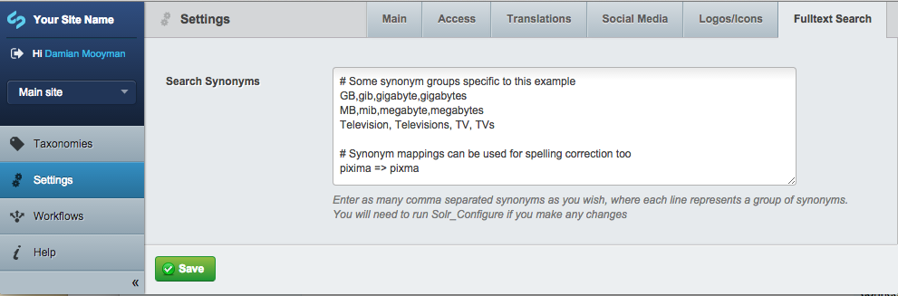

# Solr search

CWP provides a hosted Solr service to index and search the content of your site. To ensure stability of your instance
this service lives outside of your environments. The recipe pulls in the *silverstripe/fulltextsearch* module and
provides configuration to make sure it works out of the box.

The recipe comes bundled with a `CwpSolr` class which allows convenient configuration of Solr by specifying the desired
version string via the configuration system. To customise the desired version of Solr you can for example modify the
`mysite/_config/config.yml` file (don't forget to flush the cache):

	CwpSolr:
	  options:
	    version: 'your-chosen-version'

Note that if you started from a recent *cwp-installer* you might already have this configuration present in which case
it's enough to just change it.

## Acceptable Use Policy

Please note that in order to ensure adequate sharing of resources on Solr the maximum size of each indexed item
is limited to 100kb of data. If you are indexing file content, please note that files with text content exceeding
this limit will not be fully indexed, although content within this range will still be searchable.

## Configuring Solr for CWP

1.0.x branch of the recipe defaults to the 'legacy' mode which exists only for backwards compatibility. We recommend to
change it at the first opportunity to one of the proxied versions:

* (preferred) 4.x branch of Solr: use 'cwp-4'
* (buggy) 3.x branch: use 'cwp-3'

If you are setting up your project using cwp-installer (1.0.2 or later) it will override the 'legacy' setting for you
and pick the 4.x proxied version instead ('cwp-4') - see `mysite/_config/config.yml`.

## Configuring and running Solr locally

One way to develop with Solr locally is to require `silverstripe/fulltextsearch-localsolr` package as your dev
dependency in your top-level `composer.json` file. Note that this could cause Travis or any other automated buildtools
to try to include this package in their builds, thus considerably extending the build time.

You can choose to require one of the available versions of the package: `4.*@dev` or `3.*@dev`. Check the
[add-ons website](http://addons.silverstripe.org/add-ons/silverstripe/fulltextsearch-localsolr) to see the up-to-date
list of branches.

Another possibility is that you are still using the old *silverstripe-fulltextsearch* package which bundles the Solr
binary.

### Configuring

You need to make sure the site configuration reflects your setup. The following options can be used:

* (preferred) 4.x branch of Solr, via local package: use 'local-4'
* (buggy) 3.x branch of Solr, via local package: use 'local-3'
* old *silverstripe-fulltextsearch* module: use 'legacy'

These options can be configured conditionally to trigger only on dev environments. Here is one of the possible
arrangements that will detect the existence of `CWP_ENVIRONMENT` define (which should only be available on the
CWP environments):

	---
	Except:
	constantdefined: CWP_ENVIRONMENT
	---
	CwpSolr:
	  options:
	    version: 'local-4'

This will ensure that 'local-4' will be used on local environments.

### Running

To start the local server instance (if you are using the *silverstripe/fulltextsearch-localsolr* package), from your
website root do:

	$ cd fulltextsearch-localsolr
	$ ./start.sh

The screen should start filling with server messages.

Now you can create the configuration files in another terminal. Run the following from your website root:

	$ framework/sake dev/tasks/Solr_Configure "verbose=1"

And finally, reindex the pages on your website (this could take some time):

	$ framework/sake dev/tasks/Solr_Reindex "verbose=1"

You should be able to search your site now.

## Default search index

By default, a standard search index `SolrSearchIndex` is included in the default recipe. This includes basic configuration
necessary for searching pages.

	:::php
	class SolrSearchIndex extends CwpSearchIndex {
		public function init() {
			$this->addClass('SiteTree');
			$this->addAllFulltextFields();
			$this->addFilterField('ShowInSearch');

			parent::init();
		}
	}

This index extends the core `CwpSearchIndex` abstract class, which includes additional functionality specific to CWP.
Please note that if you create a custom index, it may be necessary to extend this class in order to use much
of the below functionality.

## Adding DataObject classes to Solr search

If you create a class that extends `DataObject` (and not `Page`) then it won't be automatically added to the search
index. You'll have to make some changes to add it in.

So, let's take an example of `StaffMember`:

	:::php
	<?php
	class StaffMember extends DataObject {
		private static $db = array(
			'Name' => 'Varchar(255)',
			'Abstract' => 'Text',
			'PhoneNumber' => 'Varchar(50)'
		);
		
		public function Link($action = 'show') {
			return Controller::join_links('my-controller', $action, $this->ID);
		}
		
		public function getShowInSearch() {
			return 1;
		}
	}

This `DataObject` class has the minimum code necessary to allow it to be viewed in the site search.

`Link()` will return a URL for where a user goes to view the data in more detail in the search results.
`Name` will be used as the result title, and `Abstract` the summary of the staff member which will show under the
search result title.
`getShowInSearch` is required to get the record to show in search, since all results are filtered by `ShowInSearch`.

So with that, let's create a new class called `MySolrSearchIndex`:

If using cwp recipe 1.1.1 or above

	:::php
	class MySolrSearchIndex extends CwpSearchIndex {
		public function init() {
			$this->addClass('SiteTree');
			$this->addClass('StaffMember');
			$this->addAllFulltextFields();
			$this->addFilterField('ShowInSearch');
			parent::init();
		}
	}

If using cwp recipe 1.1.0 or below

	:::php
	class MySolrSearchIndex extends SolrIndex {
		public function init() {
			$this->addClass('SiteTree');
			$this->addClass('StaffMember');
			$this->addAllFulltextFields();
			$this->addFilterField('ShowInSearch');
		}
	}

This is a copy/paste of the existing configuration but with the addition of `StaffMember`.

It's important to note that the 'index' method must call the `parent::index()` method after defining your
search fields.

Once you've created the above classes and run `flush=1`, access `dev/tasks/Solr_configure` and `dev/tasks/Solr_reindex`
to tell Solr about the new index you've just created. This will add `StaffMember` and the text fields it has to the
index.

Now in your `mysite/_config.php` file, add the following:

	:::php
	BasePage_Controller::$search_index_class = 'MySolrSearchIndex';
	BasePage_Controller::$classes_to_search[] = array(
		'class' => 'StaffMember'
	);

Now when you search on the site, `StaffMember` results will show alongside normal `Page` results.

## Boosting results

This feature requires cwp recipe 1.1.1 or above

In cases where certain documents should appear higher in search results for specific terms, boosting can be used to
promote certain keywords on a per document basis.

In order to add this functionality to pages you can use the `CwpSearchBoostExtension` in your config. The default
`search_boost` option can also be customised from the default 2.

	SiteTree:
	  search_boost: 1.5
	  extensions:
		- CwpSearchBoostExtension

Ensure that you are using either the default SolrSearchIndex, or are extending CwpSearchIndex and are calling
`parent::init()` after your custom field definitions.

	:::php
	class MySolrSearchIndex extends CwpSearchIndex {
		public function init() {
			$this->addClass('SiteTree');
			$this->addClass('PortfolioItem');
			$this->addAllFulltextFields();
			$this->addFilterField('ShowInSearch');

			parent::init();
		}
	}

Within the CMS, you can now provide a list of boost terms for each page.

## Spelling corrections and suggestions

This feature requires cwp recipe 1.1.1 or above

By default (from recipe version 1.1.1) search results will automatically attempt to detect
misspellings of search terms. If corrections for these misspellings can be found, results
for these terms will be displayed instead.

In order to disable this automatic failover you can control this behaviour via config.

	:::yaml
	BasePage_Controller:
	  search_follow_suggestions: false

Disabling this will not prevent misspellings from being detected and displayed, but 
a prompt will be displayed rather than automatically performing the search.

In order to completely disable these suggestions, remove the suggestion placeholder
from the templates as necessary.

### Enhancing spelling suggestion behaviour

This feature requires cwp recipe 1.1.1 or above

By default, all fulltext fields (everything you added through `SolrIndex->addFulltextField()`) are added
to the search index. The values of these fields are collected in a special `_text` field.
This built in `_text` field is appropriate for filtering and determining the relevance of search results,
but does not always provide appropriate spelling suggestions in all cases.

A second copy field, `_spellcheckText`, of type `textSpell`, is configured with appropriate rules for
determining spelling corrections from indexed content. These rules have been customised for generation of
spelling suggestions, rather than search results.

As with `_text`, all fulltext fields will be automatically copied into this field to generate the database
for use with spelling suggestions. In some cases it may be necessary to limit the source for these spelling
suggestions to specifically named fields. In which case, you can control which fields are copied into this
`_spellcheckText` field using the following code.

	:::php
	class MyIndex extends CwpSearchIndex {

		public function init() {
			// Copy all fields (as before) into `_text` for generating results
			$this->addClass('SiteTree');
			$this->addAllFulltextFields();
			$this->addFilterField('ShowInSearch');

			// Explicitly copy only these fields into the _spellcheckText for spelling suggestions
			$this->addCopyField('SiteTree_Title', '_spellcheckText');
			$this->addCopyField('SiteTree_Content', '_spellcheckText');

			parent::init();
		}

		
		/**
		 * Limit default destination to the `_text` field
		 * @return array
		 */
		protected function getCopyDestinations() {
			return array($this->getDefaultField());
		}

	}

### Search term synonyms

This feature requires cwp recipe 1.1.1 or above

The use of custom synonym definitions is another way in which misspelling suggestions
can be controlled.

Based on the subject matter of a site, certain words could have synonymous meanings
which should be considered when performing searches. For instance, it may be desirable
for search queries for "cellphone" to match "mobile" or "cellular".

The ability to configure this is not automatically enabled by default, but can be enabled
by adding the `SynonymsSiteConfig` extension.

	:::yaml
	SiteConfig:
	  extensions:
	    - SynonymsSiteConfig

It is also necessary to ensure that any solr index configured either extends the base `SolrSearchIndex`
class, or includes the following code (as copied from the basic recipe) to override the 
`SolrIndex::uploadConfig` method.

	:::php
	class MyIndex extends SolrIndex {

		/**
		 * Upload config for this index to the given store
		 * 
		 * @param SolrConfigStore $store
		 */
		public function uploadConfig($store) {
			parent::uploadConfig($store);

			// Upload configured synonyms {@see SynonymsSiteConfig}
			$siteConfig = SiteConfig::current_site_config();
			if($siteConfig->SearchSynonyms) {
				$store->uploadString(
					$this->getIndexName(),
					'synonyms.txt',
					$siteConfig->SearchSynonyms
				);
			}
		}

	}

Once this is enabled, the Settings section of the CMS will have a tab called "Fulltext Search"
where a list of synonyms can be configured via an editable textarea. Each list of synonyms
should be configured on a single line, with individual terms separated by a comma. Explicit
mappings of alternatives to a preferred term can be specified using the `=>` operator.

See [the Apache Solr documentation](https://wiki.apache.org/solr/AnalyzersTokenizersTokenFilters#solr.SynonymFilterFactory)
for more information on this format.

Note that only admin users (who are those with privileges necessary to run the `Solr_Configure` task)
will be able to view and edit this field.

It's essential that after changing this value, a CMS administrator should run the `Solr_Configure`
task at http://mysite.cwp.govt.nz/div/tasks/Solr_Configure. It's not necessary to run
Solr_Reindex in order for changes in synonyms to take effect.

## Searching within documents

This feature requires cwp recipe 1.1.0 or above

By default all CWP instances have text extraction services configured. These services can be used by user code
to transform text-based documents (such as PDF, MS Word, or rich text) into plain text in a format which can
be readily used as a Solr index data source, or for use by the CWP site itself.

We recommend the use of the following available services:

* Apache Tika 1.7 server can be accessed at http://localhost:9998 (which is defined by SS_TIKA_ENDPOINT for all
  instances). This provides the most effective mechanism for indexing multiple documents in quick succession, and
  supports a wide range of file formats.
* pdf2text is also available for PDF document extraction if Apache Tika does not provide the required output
  for these files.

The CWP supported [text extraction module](https://github.com/silverstripe-labs/silverstripe-textextraction) is
available to provide an interface to these services. In order to add this to a site include the following configuration:

In composer.json

	"require": {
		"silverstripe/textextraction": "~2.0.0@stable"
	}

In mysite/_config.php

	:::php
	Page_Controller::$search_index_class = 'MySolrSearchIndex';
	Page_Controller::$classes_to_search[] = array(
		'class' => 'File',
		'includeSubclasses' => true
	);

In MySolrSearchIndex.php

If using cwp recipe 1.1.1 or above

	:::php
	<?php
	class MySolrSearchIndex extends CwpSearchIndex {
		public function init() {
			$this->addClass('SiteTree');
			$this->addClass('File');
			$this->addAllFulltextFields();
			$this->addFulltextField('FileContent');
			$this->addFilterField('ShowInSearch');
			parent::init();
		}
	}

If using cwp recipe 1.1.0 or below

	:::php
	<?php
	class MySolrSearchIndex extends SolrIndex {
		public function init() {
			$this->addClass('SiteTree');
			$this->addClass('File');
			$this->addAllFulltextFields();
			$this->addFulltextField('FileContent');
			$this->addFilterField('ShowInSearch');
		}
	}

Ensure that your site's Solr index is configured by running `dev/tasks/Solr_configure` and `dev/tasks/Solr_reindex`
as above. Once indexing has completed, searching using the default search functionality should show all files
with content matching the specified search term.

## Performance Implications and Limitations

While the size of documents can vary from instance to instance, there are reasonable performance limits of
document indexing at various instance sizes.

As a general rule, given that the 100kb limitation for each indexed document is in place, the various maximum
number of documents that can be indexed are included in the "max pages in CMS" as per the 
[instance sizes](https://www.cwp.govt.nz/about/selecting-the-attributes-of-the-common-web-platform-instance-for-your-websites/)
guide. If the number of files and pages exceeds these limitations it is advisable not to include the File type
in any Solr index.

Another important consideration is the potential for downtime during indexing of content to affect your website.
If indexing a large number of documents it is advisable to upgrade to Medium or Large, as heavily trafficked Small
instances may suffer from performance degradation during background indexing processes. If indexing documents
on Small it's advisable to do so outside of normal business hours to ensure website performance is unaffected.

As a general rule, you should allocate approximately 0.5 seconds per document indexed, regardless of instance size.
This number may increase or decrease depending on the size and type of each file.

If possible this step should be performed outside of normal busy periods.

Running `dev/tasks/Solr_Reindex` will invoke the following steps, depending on your version of cwp recipe:

### If you are on 1.1.1 or above

* A single queuedjob will be added to the queue, and the `Solr_Reindex` task will immediately exit.
If there are existing reindex jobs on the queue, these will be cancelled, and any in-progress tasks will
be forced to exit.
* In the background, a worker process on the instance will invoke this job, which will first clear any obsolete
data from the search index (such as those with obsolete class names), and then create several batches of updates,
grouped by classname, variant (such as stage or subsite), and batch number. Each of these batches is a queuedjob
itself and will appear in the job queue in the cms "jobs" section.
* As each of these batch jobs is run, first obsolete records that exist in that batch will be cleared from the search
index, after which these records will be reindexed. The batching process ensures that any removed records are also
incrementally deleted from the index.
* Once the queue is complete, all indexed files will be committed to the Solr service and search will be available
again.

### If you are on 1.1.0 or below:

* All existing indexed documents will be cleared from search. These documents will not be searchable until
indexing is complete, and thus any functional dependency on this function must be factored into your workflow.
* All documents in the database will be added to a job queue. This task should only take a few minutes, but during
this time a large amount of system memory will be allocated, and will affect the performance of the instance.
* Once all documents are added to the queue, a background task will run and incrementally add each document to the
Solr service backend. During this time fewer resources are reserved, the instance will be able to respond
normally to requests. 
* Once the queue is complete, all indexed files will be committed to the Solr service and search will be available
again.
