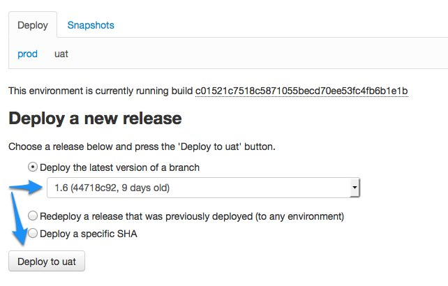
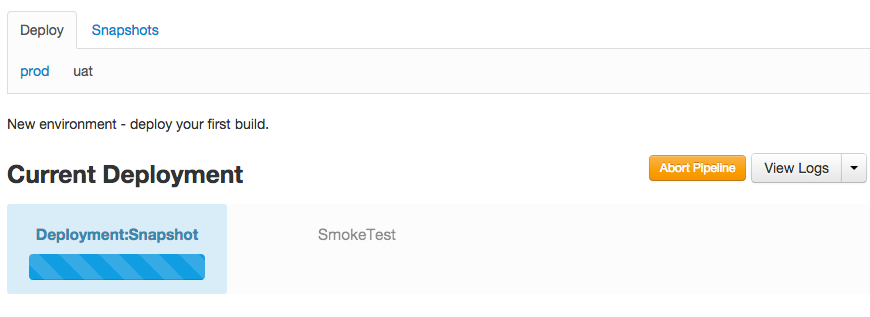
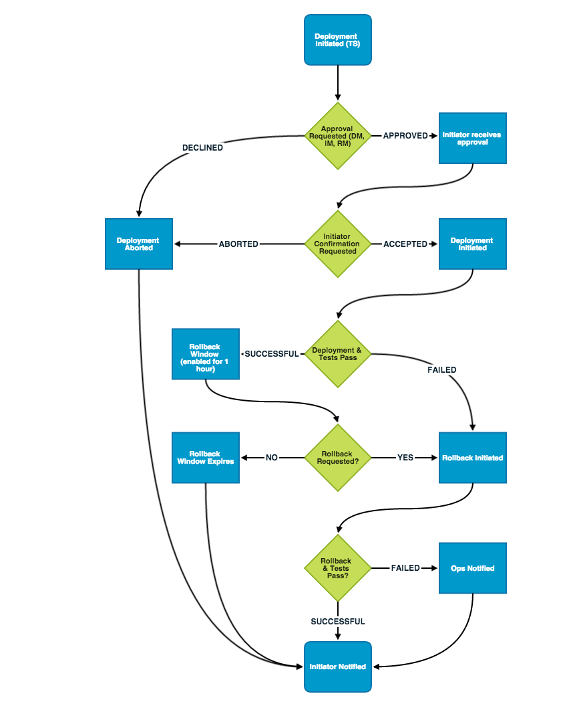

<!--
title: Deploying code
pagenumber: 7
-->

# Deploying code

This section will walk you through the deployment of a code release onto an environment.

## Overview

CWP comes with a deployment system allowing you to push releasess of code onto environments. You can access
that system by going to [deploy.cwp.govt.nz](http://deploy.cwp.govt.nz). You'll be asked for access details to get in,
which you should have already been given.

Once logged in, click through to an instance. At the top in the "Environments" table you'll see a list of available
environments along with extra information: build currently deployed and your deploy permission status.

Under "Repository" you will see information about the repository currently hooked up to this instance. One instance
can only ever have one repository assigned to it regardless of the number of environments it has.

Below, under "Public key", you can see a deployment key. One such key is generated for every instance and is used for
establishing trust between Gitlab (the code repository) and Deploynaut.

At the very bottom you will see one or more tables listing revisions found in the repository along with detected
tags and information on the environments currently running given revision.

To access the deployment history click through to the environment and see the "Deploy history" table at the very
bottom.

## Deploy key

Deploynaut needs to be able to access your repositories. This is done using private-public keypair - access is granted
by setting up the public key on the selected repositories in Gitlab. You will need to deal with the keys if you have not
requested a repository during the instance creation or if you have dependencies on private repositories.

The public key can be found in the Deploynaut interface under the "Public key" section.

It's content is not secret (there is a private counterpart that only the server knows) so proceed to Gitlab
to add it to all your repositories that need to be included in the deployment.

If you have already been set up with a repository you should have an instance key visible in the interface. Add
it by clicking "enable" button next to it.

You will only see the deployment key if you are the owner of the repository. Check the "Team" tab to see who the owner
is. Currently, if you are not the owner, you will need to ask the person to do it for you. It's a one-off task.

If you have opted for an empty instance you will need to add a "New deploy key" instead and paste the public key hash
as seen in Deploynaut.

When including private repositories remember they have to have a "private" flag set on them in the `composer.json`
file. See [working with modules](working-with-modules) for more information.

## Fetching changes

To get the latest changes available in the repository hit the "Fetch latest changes" button. This is an equivalent of a
`git fetch origin` on you local machine. After a short moment you should see new tags, branches and commits coming
through.

## Deploying

Depending on your permission level and the type of environment, the process for initiating a deployment, and
which versions of the site can be deployed, may vary.

For example Technical Staff can freely deploy to any environment, but deployments to production will involve approval
from a Deployment Manager or Instance Manager before proceeding. Additionally, only deployments previously made to
UAT may be selected when initiating a production deployment.

To deploy, choose an environment under "Environments". Under "Deploy a new release" select the revision and
press "Deploy to {environment name}".

Upon deployment the screen layout will change to the below progress bar, detailing the status of the deployment
process, and any individual step. Each step in the process will tile from left to right, allowing a simple
overview of all steps completed and yet to be invoked.

There are the following features available to users on this page:

* The "Abort Pipeline" button in the top right will allow the initiator of the deployment to cancel this process
  at any time. Depending on the current state of the process, this may involve preventing any future deployments,
  or rolling back any completed deployments in progress.
* A list of logs detailing any processes completed (or in progress) in the current pipeline. Click on "View Logs"
  to view the pipeline log, or this list may be expanded to view further logs. This contains the pipeline log,
  the logs of any individual deployments, database backup snapshots, rollback deployments, or database restorations.
* If a single step is blocked for any reason, the progress bar will be replaced with an option or list of options
  available to the user.
* If a step is in progress but not blocked, it will have a progress bar displayed. Refreshing this page will update
  the status of the pipeline.

Most of the deployment is performed as a transaction. The code is uploaded into a secondary directory before being
rotated with the original code. If the deployment fails at any point it will be rolled back without causing changes to
the site. If the deployment fails due to "unauthorised" errors, check if your project and modules have the deployment
key added as described above and that the private modules have the "private" flag set.

For the duration of the deployment a maintenance screen will be put up using `.htaccess` substitution. The webserver
will return a 503 error during that time.

The deployment process will behave differently, depending on the kind of target environment.
Generally, UAT and test environments may be deployed to freely, with fewer restrictions or approval processes in place.
Deployments to production will be governed by a more rigorous process, which requires TXT approval from a
Deployment Manager or Instance manager.

## Deploying to a test or UAT instance

The general process for deploying to test / UAT is as follows:

 * Select a commit via either branch, prior release, or an explicit commit hash.
 * Press the button named "Begin the release process on UAT"
 * Deploynaut will backup the database of the current site, and initiate a deployment.
 * Once deployment is complete, a series of "smoke tests" will be performed on the working site. This is a series
   of pre-defined urls that deploynaut expects the site to have, and will test their expected responses.
 * The initiator will be messaged (via text / email) that their deployment has succeeded.

If at any point in the process a failure occurs, the pipeline will create an additional set of steps to 
deploy back to the last known good release. These steps are:

 * Initiate the deployment targeting the last known good state
 * Repeat the smoke tests as above
 * Notify the initiator of the result

If the rollback fails then the site will be left in maintenance mode until a member of Ops can manually resolve
the issue. This does not prevent subsequent deployments.

## Deploying to production instance

The process for a production deployment requires that first a successful deployment is made to the UAT environment.

Once the above process has been completed, this commit is made available for deployment to the production environment.
When a deployment is initiated, the pipeline process is followed, as described by the diagram below:

The general process for deploying to the production environment is as follows:

 * Initiate a deployment pipeline by selecting a revision and pressing "Begin the release process".
 * An approval request will be submitted via text and / or email for verification. Please refer to [roles and
   responsibilities](https://www.cwp.govt.nz/guides/operating-guides/roles-and-responsibilities/) to understand the
   escalation path for this approval. The recipient of this verification request will be directed to login to
   deploynaut and either reject or approve it.
 * Once a response has been submitted, the initiator will be notified. If the request was accepted then the
   initiator will need to click a final "deploy" button to confirm that the deployment is being attended. This will
   immediately begin the actual deployment.
 * Deploynaut will backup the database of the current site, and initiate a deployment.
 * Once deployment is complete, a series of "smoke tests" will be performed on the working site. This is a series
   of pre-defined urls that deploynaut expects the site to have, and will test their expected responses.

If the deployment fails, or if any of the tests fail then the below process will begin:

 * Deploynaut will initiate a rollback to the last "known good" state of the production server, and restore the
   database backup made in the prior set of steps.
 * Once the rollback is complete, a series of "smoke tests" will be performed on the working site.
 * If this rollback fails, then Ops will be notified of this error and the site will be left in maintenance mode.
   At this point subsequent deployments can still be made, but they will need to follow the deployment approval
   process from the start.

If the deployment succeeds and passes all tests then the following process will begin:

 * The site will be left in a temporary state where it may be rolled back on-request. This allows the initiator to
   review the production site manually.
 * If problems or errors are noted, or the initiator requests a rollback, then they may click the "Rollback" button
   to revert the site back to the way it was prior to the release. This will also revert the database, so take care
   not to revert if there are important content updates made in this time. Unlike a normal deployment, this rollback
   request will not require further approval and can be initiated immediately.
 * After a period of one hour this rollback step will expire automatically, and the initiator will be notified by 
   text and / or email that the pipeline has completed successfully. Expiry can be invoked manually at any time
   by pressing "dismiss" on the deployment dashboard.

## Tagging your code

A good release practice is to tag a certain Git revision to a version number each time you are doing a release.

This is done by tagging a release from the developer's machine and pushing tags into Gitlab. They will be picked up
automatically by Deploynaut. To get started, first check which tags are already available:

	git tag

If you get no output, there's no tags.

Let's create a new tag. You can name the tag anything, but a typical scheme involves using version numbers. It's a good
idea to establish a versioning scheme that is known to everyone in the team - you can for example use [semantic
versioning](http://semver.org/). It's also a good idea to create annotated tags so the information about the person
doing the release is retained.

Create a new annotated tag called 1.0:

	git tag -a 1.0 -m "First release."

Tags don't get pushed automatically when you use `git push` - you need to request this specifically:

	git push origin --tags

Now when you go back to [deploy.cwp.govt.nz](http://deploy.cwp.govt.nz) and press "Fetch latest changes" you'll see
a new option appearing on the deploy screen: "Deploy a tagged release". This makes it much simpler to choose the right
revision to deploy.

## Maintenance screen

Deploynaut has an automated capability to put up a maintenance screen during deployments. See [maintenance screen](/cwp-features/maintenance_screen)
for further information on how to control it.
