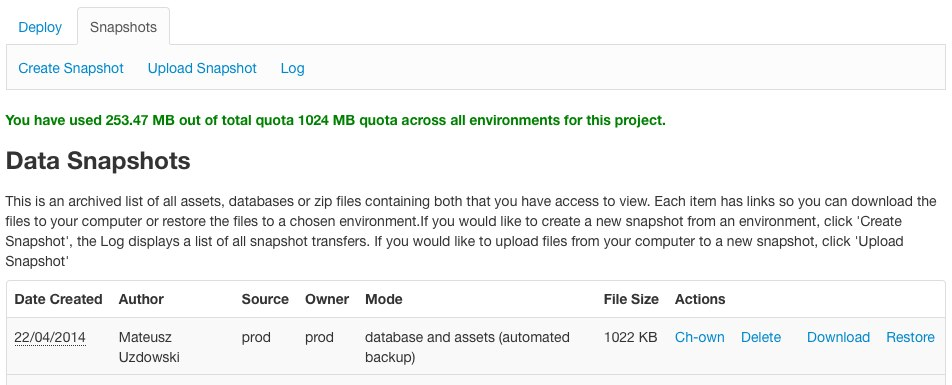

<!--
title: Transferring data
pagenumber: 8
-->

# Transferring data

This section will explain how to work with database and assets on the enviornments.

## Overview

Deploynaut comes with a snapshotting feature which allows you to manipulate the data on the environments. Log in to
Deploynaut as usual, and then click through to your project. At the top you will see a "Snapshots" menu item.

First let's explain some concepts around snapshotting.

**Snapshot** is a data archive containing either assets or database, or both. The archives bear "sspak" extension and
can be built or accessed locally using the [SSPak command-line tool](http://silverstripe.github.io/sspak/). Manual
access is also possible - sspak format relies on tar and gz to bundle the necessary files. You can find out more about
the format on the [SSPak page](http://silverstripe.github.io/sspak/).

The "Data Snapshots" area immediately visible in the Deploynaut is a staging area of shared storage. Instead of
uploading the data straight to the environment or backing it up straight to your developer machine, the snapshots are
first written to this area. This allows you to share snapshots and move them between environments without the need to
download.

Staging area includes a soft quota. Once you exceed it you won't be able to make any more snapshots (automated backups
don't count). You can exceed your quota if you upload a single large file. Quota is set per project and is shared
among all environments.

Snapshot staging area has a concept of access permissions. The "Owner" column specifies which environment the snapshot
is assigned to. You will only be able to access snapshots on the environments you have access to. You can also change
ownership of snapshots.

You can access snapshot logs at any time in the "Logs" section.

## Snapshot actions

The following actions can be performed on snapshots. Availability of some of them will rely on your permission level.

* Create snapshot: backs up the data from selected environment into the staging area.
* Upload snapshot: uploads data from your machine to the staging area.
* Delete: permanently delete the snapshot from staging. You will need to do this periodically to fit in the quota.
* Download: access the snapshot in the staging area.
* Restore: restore the snapshot onto the environment.
* Ch-own: change onwership of the snapshot. This is largely only useful for users with access to production
environments - see "Production data" below.

As a general guideline the harmful actions you need to be mindful about are (1) the restore, where you push data to an
environment and (2) "ch-own" where (as a Deployment Manager) you could make confidential data available to Technical
Staff outside of your agency.

Note that there is a limit to the size of the archive uploaded via the interface. For larger files you will need to use
the "Provide externally" option.

## Production data

Production data needs special protection: the backup and download needs to be restricted because it can contain
confidential information, and restore needs to be restricted because it can break the production site.

As a privileged user - Deployment Manager or Instance Manager - you are responsible for making sure the confidentiality
of the data is not preserved. Using the change ownership - "ch-own" - feature might mean that staff from outside of your
agency will gain access to the data.

As a Technical Staff you will not have access to the production evnironment. You will need to talk with your Deployment
Manager (or if none has been set up - with your Instance Manager) to organise the backup or restoration for you.

### Making production snapshots

If you are a privileged user - Deployment Manager or Instance Manager - you can log in to Deploynaut and make production
snapshots at will. These snapshots are at first "owned" by production environment and will not be accessible by the
Technical Staff.

You can immediately make a snapshot available by selecting the "Ch-own" action and transferring the ownership to
UAT. From that point onwards the snapshot will be available byt all your Technical Staff.

You can also download the snapshot to your local machine and perform the sanitisation tasks before making it available
to others.

### Restoring to production

If you are a privileged user you will be able to restore snapshots to production at any time.

Find the desired snapshot in the staging area. Press "restore" and select "prod" from the environment dropdown. You can
restore snapshots originating in any environment so the Technical Staff can prepare one for you earlier in the UAT
environment.

## Automated backups

Whenever assets are restored Deploynaut will automatically create a backup snapshot in case you need to roll the
restoration back later. The only difference to the regular snapshots is that automatic backups don't count against the
quota.

## Maintenance screen

As with deployments, a maintenance screen will be put up during the snapshot restorations. See [maintenance
screen](cwp-features/maintenance_screen) for further information on how to control it.
