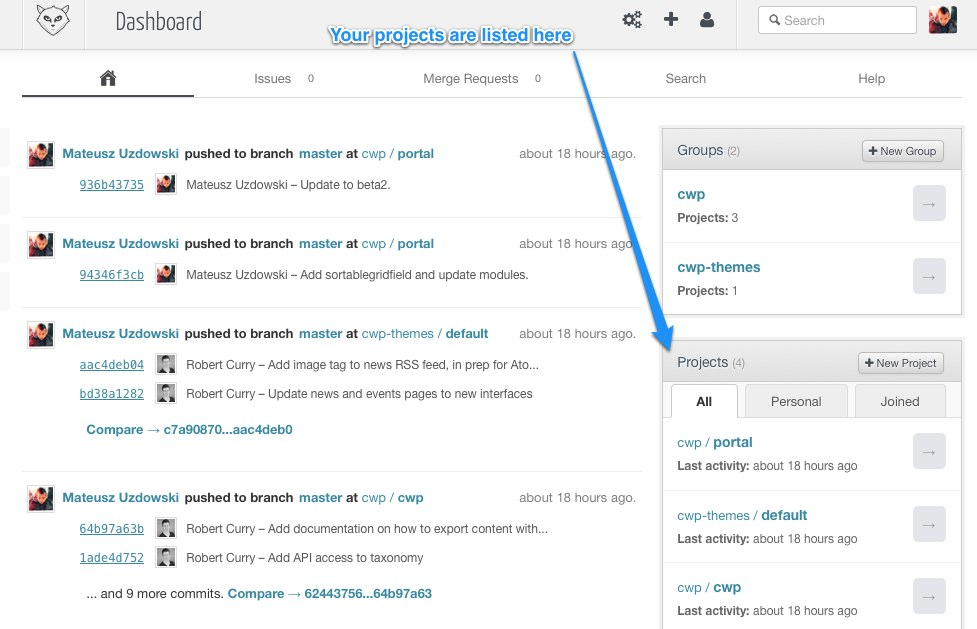

# Gitlab Setup

This documentation describes how to setup Git in your local development environment, and how to access the Gitlab admin
interface for managing code repositories.

It's assumed you're familiar with Git. If not, we recommend reading through tutorials on using Git, available online.
The [Pro Git](http://git-scm.com/book) book is a good reference to start with.

## Accessing Gitlab

Gitlab is available by accessing [http://gitlab.cwp.govt.nz](http://gitlab.cwp.govt.nz).

Once you're there, you'll be asked for an email and password. These details should've been emailed to you, so you can
enter these details now.

## Installing Git

If you're on Mac OS X, one way to get Git installed is to get Xcode with command line tools component included. Git will
be included in that package.

On Linux, depending on your flavour, the package manager should have Git available so you can install it.  On Debian or
Ubuntu Linux `apt-get install git` should be enough to get you started.

On Windows install [mysysgit](http://msysgit.github.com/) which provides Git support on Windows.

## Configuring Git

Setup your global user name and e-mail:

	git config --global user.name "<Your Name>"
	git config --global user.email "<Your E-mail Address"

These will identify you in code commits.

## Checking out your repository

When accessing Gitlab, you'll see a page like this. On the right hand side is a listing of your projects you have
access to. Access a project from here to find more information including the repository details:

Use HTTPS address for interacting with your repository - SSH transport is not available currently.

Now that you have the repository URL for the project, you can check it out into your environment with the following
command:

	git checkout <url> /path/to/webroot/myproject

Replace `/path/to...` with the path on your computer where you wish to store the project code.

## Your first commit to the repository

`cd` into the path where you checked out your repository.

Create a new empty README file and commit it:

	git add README
	git commit -m 'Adding README file'
	git push -u origin master

You will be asked for Gitlab credentials. After providing them, your commit will be pushed into the remote repository.

If you go back to the project page in Gitlab, and access the **Commits** tab you should see your change.
Congratulations!

## Caching Gitlab passwords

You can avoid having to type the password in every time by using Git credential helper.

The easiest way is to use the in-built cacher:

	git config --global credential.helper cache

You can adjust the timeout period from the default 15 minutes:

	git config credential.helper 'cache --timeout=3600'

See [this stackoverflow
thread](http://stackoverflow.com/questions/5343068/is-there-a-way-to-skip-password-typing-when-using-https-github) for
more information.

Another way to approach this is to store the password in a keychain on your machine using the software built by GitHub.
This will allow you to remember the password permanently. The software is available from [GitHub
](https://help.github.com/articles/set-up-git).

GitHub is an entirely different product than Gitlab. It is a company and a maker of a popular website
[github.com](http://github.com). Their software is purpose-built and as such may not always work well with Gitlab.

## Where to from here?

[Setting up your project](../gitlab/setting-up-your-project) documentation will help you get started setting up
SilverStripe CMS and framework code, along with default templates.

