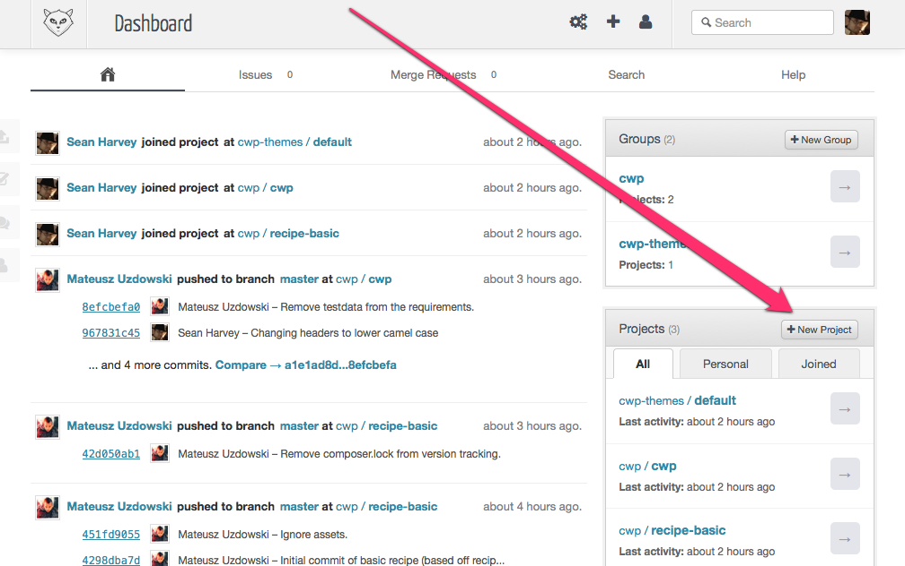
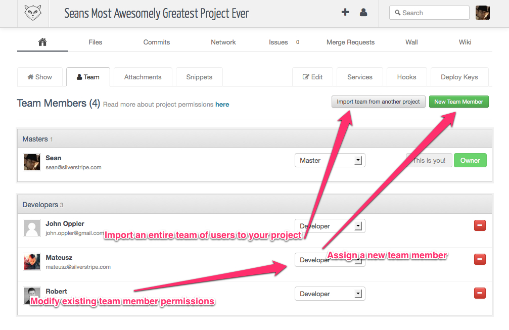

<!--
title: Creating a project/repository
pagenumber: 5
-->

# Creating a project/repository

In Gitlab, a **Project** is also considered to be a repository.

Create a new one by clicking the **New Project** button in the Gitlab **Dashboard**.

## Assigning access to the project

The **Team** tab in your project view in Gitlab allows you to add new team members, import an entire team of other
users to the project, or modify existing team member permissions to the project.

There are different levels of access a user can have to your project.
[Gitlab permissions help](http://gitlab.cwp.govt.nz/help/permissions) has more information on the levels of permission
you can give users.

## Making the project public

Unless you don't want others to see it, you can create your project public by going to **Edit** tab while
viewing your project in Gitlab and checking the **Public clone access** checkbox.

This will mean anyone can `git checkout` your project.

It will also be listed on the [Gitlab Public Projects](http://gitlab.cwp.govt.nz/public) list.

