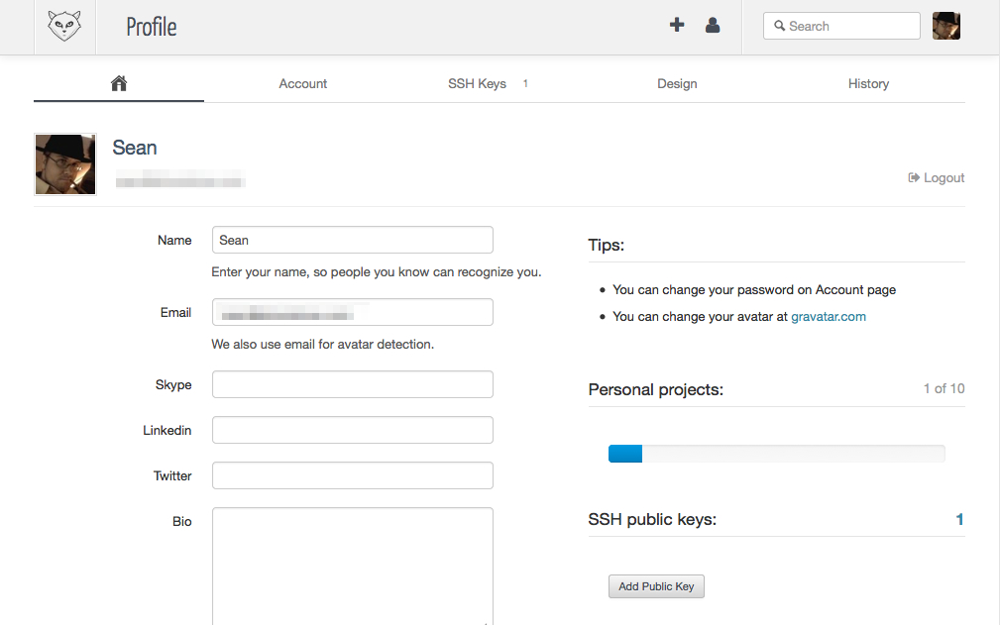
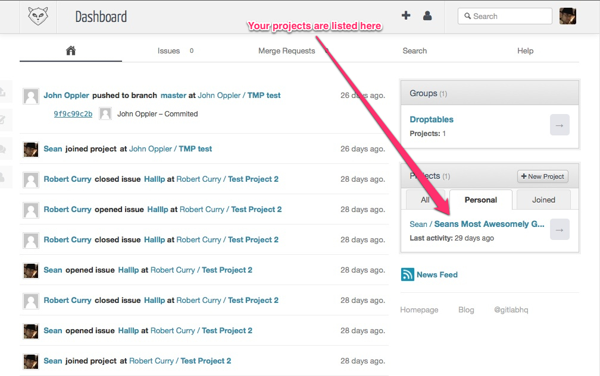
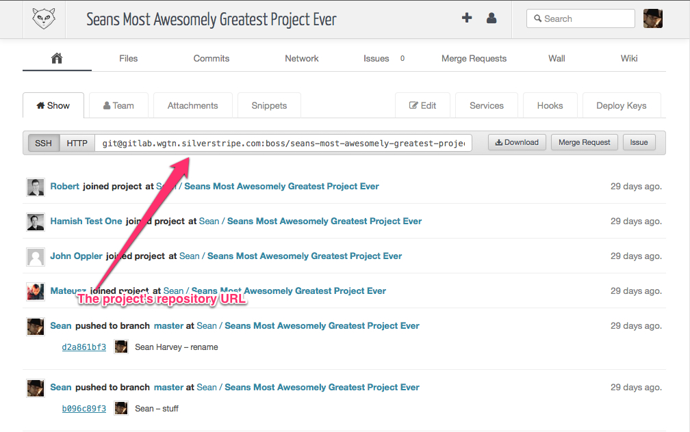

# Gitlab Setup

This documentation describes how to setup Git in your local development environment, and how to access the Gitlab admin
interface for managing code repositories.

It's assumed you're familiar with Git. If not, we recommend reading through tutorials on using Git, available online.
The [Pro Git](http://git-scm.com/book) book is a good reference to start with.

## Accessing Gitlab

Gitlab is available by accessing [http://gitlab.cwp.govt.nz](http://gitlab.cwp.govt.nz).

Once you're there, you'll be asked for an email and password. These details should've been emailed to you, so you can
enter these details now to access Gitlab.

## Installing Git

If you're on Mac OS X, Git is already installed.

Depending on your flavour of Linux, the package manager should have Git available so you can install it.
On Debian or Ubuntu Linux `apt-get install git` should be enough to get you started.

Windows is a bit trickier, but fortunately there's a third-party application [mysysgit](http://code.google.com/p/msysgit)
which provides Git support on Windows.

## Create an SSH public key

Git uses SSH keys for authorisation of users.

Check you don't already have an SSH public key by opening `~/your_username/.ssh/id_rsa.pub`.
If the file exists, you already have one, in which case you can skip this step. If not, let's create one:

	ssh-keygen -t rsa "your_email@youremail.com"

You can press enter to all prompts as defaults, and it's recommended you enter a passphrase for security.

Once that's done, you'll have a new file at `~/your_username/.ssh/id_rsa.pub`, this contains your key.

## Entering your SSH key into Gitlab

Your SSH key needs to be entered into Gitlab so you have authorisation to checkout and commit code to your
repositories. Let's do that now.

Hover over your avatar icon in the top right of Gitlab and click **My profile** that pops up.

Now we're in your user profile. Click **Add Public Key**

Enter a name for the key in the **Title** field, this will help you identify the key. It's especially useful if you
have multiple development environments with different SSH keys. A good example might be your username and the name
of the computer.

Enter the contents of the `~/your_username/.ssh/id_rsa.pub` file into the **Key** field

Hit **Save**.

## Configuring Git

Setup your global user name and e-mail:

	git config --global user.name "<Your Name>"
	git config --global user.email "<Your E-mail Address"

These will identify you in code commits.

## Checking out your repository

When given access to Gitlab you should have access to a single project to start with.

The above screenshot shows where you can find your projects. Access your project
to get a screen with more details on that project, including the repository URL:

Now that you have the URL, you can check it out into your environment with the following command:

	git checkout <url> /path/to/webroot/myproject

Replace `/path/to...` with the path on your computer where you wish to store the project code.

## Your first commit to the repository

Create a new empty README file and commit it:

	git add README
	git commit -m 'Adding README file'
	git push -u origin master

You've just done your first commit. Congratulations!

