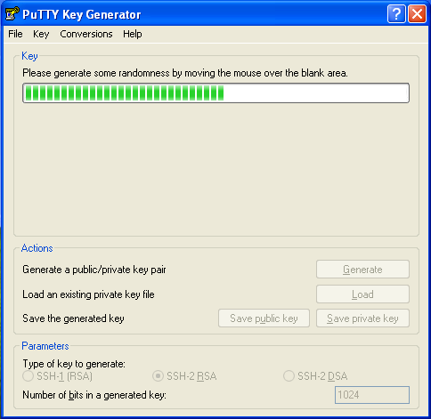
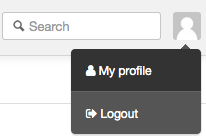

# Generating SSH Keys

## Windows
You can generate SSH keys on Windows using PuTTY - a free SSH client for Windows.

* Download the [latest PuTTY installer](http://www.chiark.greenend.org.uk/~sgtatham/putty/download.html)

* Open PuTTYgen.exe and press the Generate button and move the mouse around the blank area in the PuTTYgen window until the progress bar completly fills in. Once the keys are generated, type in a key passphrase (recommended) then "Save Public key" and "Save Private key".

## Mac & Linux
First check you don't already have an SSH key - if you do then you can use it.

        ls -la ~/.ssh

If you see a file with the extension .pub then that would indicate you already have an SSH key ready for use.

### Generate SSH keys

        $ ssh-keygen -t rsa

It is easiest to accept the default values, but it is recommended to also supply a passphrase.

Once the generation process is complete, your public and private keys should be available in ~/.ssh

# Adding Your Public Key to Your Profile

To add public SSH keys to your profile, go to your "My Profile" section

* Click on SSH Keys in the menu
* Click on "Add new"
* Paste your public key in to "Key" field and click Save

