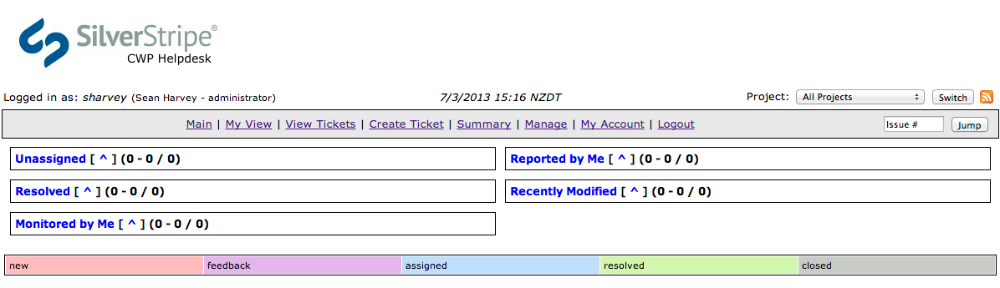
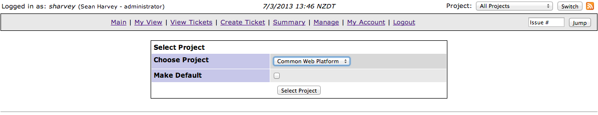
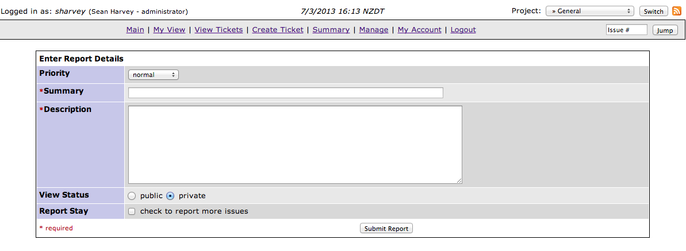

# Helpdesk

## Introduction

A [helpdesk system](http://mantis.cwp.govt.nz) is provided, allowing participating agencies to file a tickets when
platform assistance is needed, or when they wish to create a new server instance.

This document describes basic use of the helpdesk system to create a new ticket.

The helpdesk is located at [http://mantis.cwp.govt.nz](http://mantis.cwp.govt.nz)

You'll receive an email with login details to the Helpdesk system. Follow the link in the email to set yourself a
password and then log into [http://mantis.cwp.govt.nz](http://mantis.cwp.govt.nz).

## Creating a ticket

Once logged in you should see a page with a summary of your tickets. For the first time, you'll see nothing here, but
it'll be useful later to see the current status of your tickets.

Click **Create Ticket**

You'll notice at the top right a dropdown of projects is showing **All Projects**, this means that when you're creating
a new ticket you'll have to select which project that ticket should be filed against. Alternatively, you can select a
project in the dropdown first, then click **Create Ticket**.

Choose **General** when asked for which project to select.

Now we get a screen with some fields to fill out about the request. **Summary** is a one-liner describing the request,
and **Description** is where you explain your request in further detail.

Once you've filled out the fields, click **Submit Report** and you're done. The platform team will be emailed about
your request and you'll receive emails when the ticket is updated with progress.

## Requesting a new instance

Above we talked about filing a general request. Now we'll talk about filing a more specific request, and that is one
requesting a new instance.

Click the **Project** dropdown at the top right of helpdesk and choose **Instance Request**.

Click **Create Ticket**. You'll notice there's a few additional fields specific to the new instance request, such as
which instance size and disaster recovery level.

Fill these out and hit **Submit Report**. The platform team will be emailed about your request and you'll receive
emails when the ticket is updated with progress.

## Email notification preferences

You can specify in your user preferences when you want to receive email notifications.

First go to **My Account** and then **Preferences**.

The checkboxes **E-mail on...** control which events you'll receive an email notification. Set these as you want them
and hit **Update prefs**.
