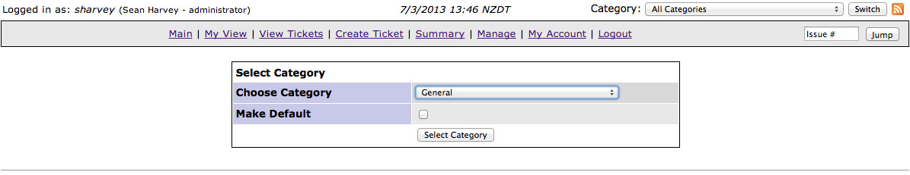

# Helpdesk

A [helpdesk system](http://helpdesk.cwp.govt.nz) is provided, allowing participating agencies to file a ticket when
platform assistance is needed or when they wish to create a new server instance.

This document describes basic use of the helpdesk system to create a new ticket.

The helpdesk is located at [http://helpdesk.cwp.govt.nz](http://helpdesk.cwp.govt.nz)

When a new user is created in the CWP system they will receive an email with login details to the helpdesk system.
Follow the link in the email to set yourself a password and then log into
[http://helpdesk.cwp.govt.nz](http://helpdesk.cwp.govt.nz).

## Access

Every user on the CWP platform has access to the helpdesk and is able to make requests. If any request is deemed
"dangerous" (possible to cause an outage) or requires a financial expenditure from the partipating agency, then the
request is sent to a technical contact for approval before any action is taken.

## Raising a ticket

Once logged in you should see a page with a summary of your tickets. For the first time, you'll see nothing here, but
it'll be useful later to see the current status of your tickets.

Click **Create Ticket**

You'll notice at the top right a dropdown of categories is showing **All Categories**, this means that when you're 
creating a new ticket you'll have to select which category of ticket you'd like to file. Alternatively, you can select
a category in the dropdown first, then click **Create Ticket**.

Choose **General** when asked for which category to select.

Now we get a screen with some fields to fill out about the request. **Summary** is a one-liner describing the request,
and **Description** is where you explain your request in further detail.

Once you've filled out the fields, click **Submit Report** and you're done. The platform team will be emailed about
your request and you'll receive emails when the ticket is updated with progress.

## Ticket categories

### Deploy UAT to production

This ticket is used to deploy the exact code (not page content or files) that exist on the UAT environment to the
production environment. In other words, update the live site.

This is deemed a "dangerous" action and requires the approval of a technical contact.

### General

This is used for all tickets that don't fall into the other categories.

### Add Additional Test Environment

This is used to create a new test environment inside the requested instance. This should be used in the case that an
extra test environment is necessary for development - one development team might be working on an different feature
from the main development team, so require a separate testing environment to work on.

This will incur additional costs and requires the approval of a technical contact.

### Alter domains

This is used if an instance should be responding to different domains that it currently is. Please note that this will
not take care of the DNS, that is left up to the agency to manage. This just controls which sites CWP will serve up to
visitors based on the domain they're asking to browse.

### Request new instance

This is used to create an entirely new instance controlled by the participating agency. This requires a substantial
amount of information and is usually filled out with assistance from a representative of the service provider, at least
for an agency's first instance.

This will incur ongoing costs and requires the approval of the agency-wide technical contact.

### Transfer database and assets

This is used to syncronise the content (page content and files) between environments within an instance. This is
commonly used when wanting to work with the production content on the UAT environment, or if the content has been
entered on the UAT environment to be "deployed" to the production environment.

### Add new user

This will create a new user and give that user access to the portal, helpdesk, documentation and deploynaut sites. It
won't give them access to Gitlab or any of the CMS instances - these have to be set up as necessary.

When you create a user you have the choice of granting access to all of the agency's websites or just a set of
instances. If you choose "All instances" this will include every instance owned by the agency, even those created in
the future. If you choose "Specified instances only" then you will need to list the instance IDs that you wish to
grant the user access to.

### Alter access to isntances

This will grant or remove access to the instances that you specify for the user that you specify.

If the specified user has agency-wide access and there are instance IDs to be removed, then the user will keep access
to all of the agency's instances that are not specified.

### Remove existing user

This will remove the user from access to the CWP portal, helpdesk, documentation and deploynaut sites. Note that it
will not remove access to Gitlab or any instance's CMS as these aren't managed through the portal. These will have to
be removed manually.

### Reset password

This will reset the specified user's password on the CWP portal, helpdesk, documentation and deploynaut sites. Their
new password will be emailed to them.

## Instance ID

Many of the tickets require the "Instance ID" to be specified. This is the unique identifier that each instance is
given when it is created. It is usually, but not always, the primary domain name of the instance. It can be found on
the portal for that instance.

## Email notification preferences

You can specify in your user preferences when you want to receive email notifications.

First go to **My Account** and then **Preferences**.

The checkboxes **E-mail on...** control which events you'll receive an email notification. Set these as you want them
and hit **Update prefs**.