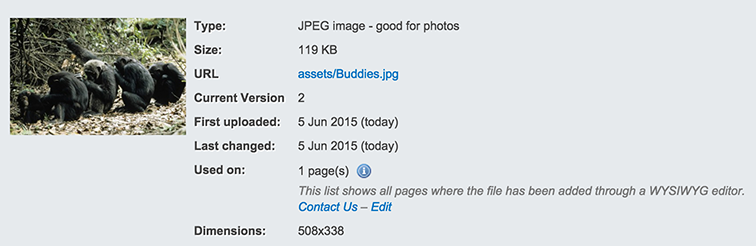

# CWP Recipe 1.1.0

## Overview

This release tracks the Framework release 3.1.13. There are several security fixes and major features included.

Please see the changelogs for these following releases for the list of core changes since recipe 1.0.7

 * [framework 3.1.13](http://doc.silverstripe.org/en/changelogs/3.1.13/)

## New Features and Modules

The following new major features are included in this release:

 * Full blogging support, including nested comments, moderation tools, and multi-user functionality. Details on the new blog recipe can be found on the [blog recipe](/cwp-features/blog_recipe) page.
 * The ability to index and search uploaded documents via fulltext search. This is currently a beta feature, and any agency using this are advised to complete feasibility testing on any target instance. Details on configuring your instance for searching documents can be found on the [solr search](/cwp-features/solr_search) page.
 * A Single Sign On functionality for SilverStripe intranet sites been created. It is optional functionality and will require specific infrastructure architecture. See the [single sign on documentation](/cwp-features/single_sign_on).

Also included is a new file tracking system to display which pages each image appears on.

## Security Release Notes

For details on the specifics of these security fixes, please refer to our
[security release announcement page](http://www.silverstripe.org/software/download/security-releases/).

Information to help manage upgrades is [here](https://www.cwp.govt.nz/features/common-web-platform-services-explained/#releasemanagement).

## Upgrading Instructions

In order to assist agencies to upgrade their existing sites without the inclusion of new 1.1.0 blog features,
these have been separated into a new module, [cwp-recipe-blog](https://gitlab.cwp.govt.nz/cwp/cwp-recipe-blog),
which can be optionally excluded from any upgrade if desired.

Document searching and Active Directory are supported but not installed by default, and thus can be excluded from
any upgrade.

In order to update an existing site to use the new basic recipe the following changes to your composer.json
can be made:

	"require": {
		"cwp/cwp-recipe-basic": "~1.1.0@stable",
		"cwp-themes/default": "~1.1.0@stable"
	}

Inclusion of the new blogging recipe requires both the above upgrade step, as well as the separate recipe requirement:

	"require": {
		"cwp/cwp-recipe-blog": "~1.1.0@stable"
	}

## Details

### Bugfixes

 * [CWP-211] - Bug - Portal password reset to reset pw on other services
 * [CWP-336] - (ORB 115) Make textextraction module work on php 5.3.3
 * [CWP-461] - RSS Feeds should be created offline and served statically

### Features

 * [CWP-434] - SOLR EnvironmentCheck included in basic recipe
 * [CWP-310] - (ORB 115) SOLR Document Indexing
 * [OSS-179] - (ORB 115) Search inside documents
 * [CWP-579] - (ORB 94) Active Directory (AD) support for CWP
 * [OSS-180] - (ORB 108) File usage list in Assets section
 * [OSS-274] - (ORB 93) Redesign blomment (blog + comment) interface
 * [OSS-271] - (ORB 93) Move CWP blog recipe to use Michael Strong's module
 * [OSS-259] - (ORB 93) Blog Editor Management (MVP)
 * [OSS-262] - (ORB 93) Blog Editor Publishing Feature (MVP)
 * [OSS-260] - (ORB 93) Blog Author Management (MVP)
 * [OSS-263] - (ORB 93) Blog author publishing feature (MVP)
 * [OSS-264] - (ORB 93) Blog Contributor Management (MVP)
 * [OSS-272] - (ORB 93) Blog contributor authorship feature (MVP)
 * [OSS-257] - (ORB 93) Blog Comment Anti-spam (MVP)
 * [OSS-273] - (ORB 93) Blog Comment Email Notifications (MVP)
 * [OSS-261] - (ORB 93) Comments Base Template (MVP)

### Accepted failing tests

#### framework

 * DirectorTest.testAlternativeBaseURL - Test passes locally when run in
 isolation.
 * CMSProfileControllerTest.testMemberCantEditAnother — Problem with
 Requirements combining the same file twice, non-critical Framework issue.
 * UploadTest.testUploadTarGzFileTwiceAppendsNumber — This test is now expected
 to fail as the new MimeValidator module will no longer allow random content to
 be uploaded with a mismatched mime and file extension. The original test is
 attempting to upload a bunch of text as a gzip file.
 * i18nTextCollectorTest.testCollectFromThemesTemplates — Caused by global
 state, passes locally when the test is run individually.
 * RequirementsTest.testCommentedOutScriptTagIsIgnored - Test passes locally
 when run in isolation.

#### cms

 * CMSMainTest.testCreationOfRestrictedPage — Problem with Requirements
 combining the same file twice. Non-critical Framework issue.

#### queuedjobs

 * QueuedJobsTest.testStartJob — Caused by global state, passes locally when
 the test is run individually.
 * QueuedJobsTest.testImmediateQueuedJob — Caused by global state, passes
 locally when run either individually or as a part of all queuedjobs tests.
