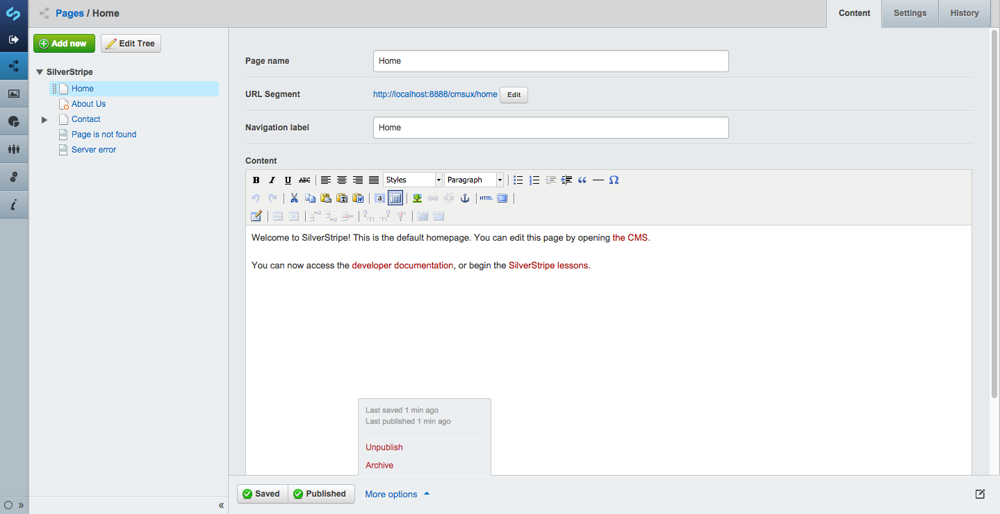

# CWP Recipe 1.2.0

## Overview

This recipe release will be the first to include a new minor SilverStripe framework version, updating the core 
to follow the 3.2 feature branch from 3.1.

This release tracks framework 3.2.1, and includes several security fixes.
Please see the changelogs for these following releases for the list of core changes since recipe 1.1.2

 * [framework 3.2.0](https://docs.silverstripe.org/en/3.2/changelogs/3.2.0/)
 * [framework 3.2.1](https://docs.silverstripe.org/en/3.2/changelogs/3.2.1/)

Agencies must upgrade prior to 1st March 2016. Please organise this with your developers as soon as possible.
If an agency has not upgraded by that date, SilverStripe is obliged to perform the upgrade under the terms of
the contract. This is a last resort as it will incur cost and creates a risk of functionality breaking.

## New Features and Modules

* The [content review module](https://github.com/silverstripe/silverstripe-contentreview) has been added to
  the default recipe. This feature will allow administrators and content editors to set up schedules
  for periodic review of site content. Notifications will be managed via periodic email notifications,
  as well as a CMS report for content due for review. This module is installed and available by default.
   
* The [site-wide content report](https://github.com/silverstripe/silverstripe-sitewidecontent-report)
  provides a subsite-filterable report of all files and pages on the site. This provides an easy to access
  high level summary of site size and structure. This module is installed and available by default.
  
* The [Realme authentication module](https://github.com/silverstripe/silverstripe-realme) Provides CWP
  site authentication via [www.realme.govt.nz](https://www.realme.govt.nz/).
  This module must be installed separately, and requires server side configuration before it may be used.
  See the [CWP realme documentation](/cwp-features/realme_authentication) for more information.

* Update of framework to version 3.2. This includes a large number of major changes.
  - Several minor UX improvements, such as improved visibility of changed pages in the site tree,
    better panel collapse behaviour, and page management.
  - A new "archive" action, which can be applied to several pages in a single batch action. We have also
    introduced a "restore" batch action to quickly revert groups of deleted pages.
  - The database API has been updated to support parameterised queries, which removes the need to escape strings
    for use in the database, greatly improving the security of applications by reducing the risk of SQL injection.
  - Reports and Siteconfig have been moved to separate modules.

For more information on how to prepare your existing code for compatibility with 3.2, please review
[the 3.2 changelog](https://docs.silverstripe.org/en/3.2/changelogs/3.2.0/) for specific upgrading instructions.

Please note that the PDO connector, although a new framework feature, is not currently available in CWP.

## Details of security issues

This release includes fixes for the following issues:

 * [SS-2015-021](http://www.silverstripe.org/download/security-releases/ss-2015-021/): When SSViewer rewrites hash
   links, it takes the whole URL after the base and prepends it to the hash. However this URL isn't well filtered,
   so a URL like "http&#58;//example.com//evil.com" will have it's hash links be rewritten to be "//evil.com#". This
   fix has been resolved by pre-filtering $_SERVER['REQUEST_URI'] to clean leading double-slashes which would
   otherwise denote such urls as protocol-relative links.
 * [SS-2015-022](http://www.silverstripe.org/download/security-releases/ss-2015-022/): When RSSLink is created it
   is given a URL which is rendered via $Link in a template, which is not escaped properly. This was resolved by
   ensuring that $Link is cast to Varchar, which is XML encoded by default in any template.
 * [SS-2015-023](http://www.silverstripe.org/download/security-releases/ss-2015-023/): Advanced workflow member
   field exposure. By default, the CMS Admin editable template for the NotifyUsers action has access to a large
   number of fields, including (for instance) Member#Password. This would allow a malicious CMS Admin to extract
   other admin passwords by adding a template emailing these fields to themselves when other admins trigger the
   workflow.
 * [SS-2015-024](http://www.silverstripe.org/download/security-releases/ss-2015-024/): Queued jobs serialised
   data exposure. SavedJobData and SavedJobMessages contain php serialised data. There's no point showing these
   to a CMS Admin as they're not human readable. Worse, it might be insecure, as a malicious CMS Admin might be
   able to craft a payload thats dangerous to unserialise.
 * [SS-2015-025](http://www.silverstripe.org/download/security-releases/ss-2015-025/): RequestHandler would
   include the class name in the unstyled 403 & 404 responses. This is a slight information leak that could
   be used by an attacker. This issue has been resolved by suppressing these errors on live.
 * [SS-2015-026](http://www.silverstripe.org/download/security-releases/ss-2015-026/): A high severity XSS
   risk has been identified in the encoding of validation messages in certain FormField classes. Certain
   fields such as the NumericField and DropdownField have been identified, but any form field which presents
   any invalid content as a part of its validation response will be at risk.
 * [SS-2015-027](http://www.silverstripe.org/download/security-releases/ss-2015-027/): When embedding files
   in the HTML editor, "Add from URL" doesn't clearly sanitise URL server side. This action gets the URL to
   add in the GET parameter FileURL. However it doesn't do any URL sanitising server side. The current logic
   will pass this through to Oembed, which will probably reject most dangerous URLs, but it's possible future
   changes would break this.

## Upgrading Instructions

In order to update an existing site to use the new basic recipe the following changes to your composer.json
can be made:

	:::js
	"require": {
		"cwp/cwp-recipe-basic": "~1.2.0@stable",
		"cwp/cwp-recipe-blog": "~1.2.0@stable",
		"cwp-themes/default": "~1.2.0@stable"
	}

## Details

### Enhancements

 * [CWP-646] - CWP recipe works on PHP 5.6
 * [OSS-1096] - Sitewide Report Column Adjustments
 * [OSS-1095] - Content Review Module: Instant review button
 * [OSS-1094] - Content Review Module: Edit email content
 * [OSS-1093] - Content Review Module: Current User Filter

### Bugfixes

 * [OSS-983] - Categories and tags are not displayed on individual blog post page
 * [CWP-571] - Subsite Virtual Page Problems
 * [OSS-1053] - Resolve userforms SQL error in 3.2
 * [OSS-1052] - Fix translatable button missing in 3.2
 * [CWP-697] - Incomplete SubsiteXHRController canAccess() method
 * [CWP-647] - Fix issue with all subsites using https:// protocol

### Known issues

In recipe 1.2.0 there are the following known issues in these failing tests:

#### framework

 * FolderTest.testRenameFolderAndCheckTheFile - Known compatibility issue in versionedfiles
   with 3.2. See https://github.com/silverstripe-australia/silverstripe-versionedfiles/issues/43
 * FolderTest.testSetNameChangesFilesystemOnWrite - Known compatibility issue in versionedfiles
   with 3.2. See https://github.com/silverstripe-australia/silverstripe-versionedfiles/issues/43
 * FolderTest.testSetParentIDChangesFilesystemOnWrite - Known compatibility issue in versionedfiles
   with 3.2. See https://github.com/silverstripe-australia/silverstripe-versionedfiles/issues/43

#### subsites

 * FileSubsitesTest.testWritingSubsiteID - Known compatibility issue in versionedfiles
   with 3.2. See https://github.com/silverstripe-australia/silverstripe-versionedfiles/issues/43

### Accepted failing tests

In recipe 1.2.0 these module unit tests cause external errors, but do not represent legitimate issues.

#### framework

 * UploadFieldTest.testAllowedExtensions — Behaviour intentionally altered by the MimeValidator module
 * UploadFieldTest.testSelect — Behaviour altered by SelectUploadField intentionally
 * UploadTest.testUploadTarGzFileTwiceAppendsNumber — This test is now expected
   to fail as the new MimeValidator module will no longer allow random content to
   be uploaded with a mismatched mime and file extension. The original test is
   attempting to upload a bunch of text as a gzip file.
 * FormTest.testMessageEscapeHtml - Test susceptible to custom unrelated changes in theme.
   Resolved in a future release.
