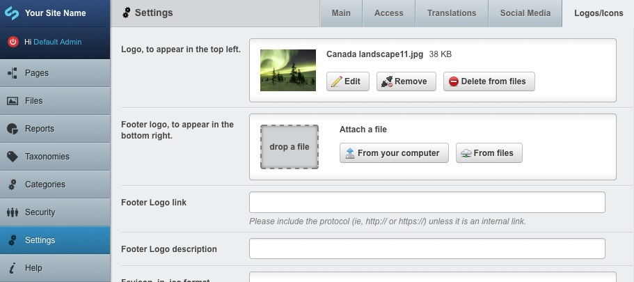
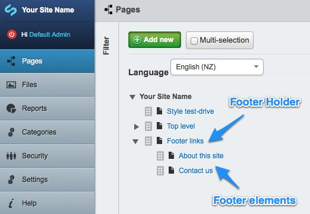

# User Howto

This howto is intended for the users of the CMS. It details all additional options provided by SilverStripe Express.
For standard SilverStripe functions please refer to the [general user documentation](http://userhelp.silverstripe.org/).

## Customising the site-wide title

The site-wide title can be configured through *Settings* section, *Main* subsection in the CMS - enter the title in the
*Site title* field, and press *Save*. 

This change will affect several areas in the site, but specifics depend on the template used. Default template will
display the title in the header area, in the footer copyright and in the page title.

Note: *Site Tagline/Slogan* field is not used in the default template.

## Setting up Google Analytics

SilverStripe Express comes with an ability to configure Google Analytics via the CMS. To set it up, follow these steps:

* Find out your GA Account number, by visiting Google Analytics' website
* Open the CMS, and proceed to Settings section
* Enter the code into the `Google Analytics account` field
* Save the settings

## Setting up social media and sharing

You can add a link to your organisation's Facebook page by following these steps:

* Visit your Facebook page
* Copy the parts of the URL that appear after 'facebook.com' So, if your URL was
http://www.facebook.com/visitnewzealand, copy 'visitnewzealand'.
If it was http://www.facebook.com/profile.php?id=12635800428, then copy 'profile.php?id=12635800428'
* Open the CMS, and proceed to the Settings section
* Open the 'Social Media' tab
* Paste the copied part of the URL into the `Facebook UID or username` field
* Save the settings

In a similar way, you can add a link to your organisation's Twitter account:

* Open the CMS, and proceed to the Settings section
* Open the 'Social Media' tab
* Enter your Twitter username into the `Twitter username` field
* Save the settings

When using the default SilverStripe Express theme, these two options will add linked icons in the bottom right of each
page.

You can also let your site visitors share pages on your site through their own social networks by setting up AddThis.
To do this:

* If you don't have an AddThis account already, set one up by visiting http://www.addthis.com/ and clicking on
`Create Account`.
* Open the CMS, and proceed to the Settings section
* Open the 'Social Media' tab
* Enter your AddThis profile ID into the `AddThis Profile Id` field
* Save the settings

When using the default SilverStripe Express theme, this will add a 'Share' button on the top right of each page.

## Customising logos

With the default CWP theme two default logos are shown:

* An organisation logo in the top left, next to the site name.
* The newzealand.govt.nz logo in the bottom right.

These can be overridden as follows:

* Open the CMS, and proceed to the *Settings* section, *Logos* subsection.
* Customise the organisation logo by attaching an image to the *Logo, to appear in the top left.*
* Replace the "newzealand.govt.nz" logo by attaching an image to the *Footer logo, to appear in the bottom right.*
  * Set a custom link by filling the *Footer Logo link* field.
  * Set an accessibility description (that will propagate to "title" and "alt" attributes) by filling the *Footer Logo
  description* field.
* Press *Save*.

The logos aren't automatically resized, so make sure they are exactly the size you'd like them to appear before
uploading them.

## Embedding iframes

SS Express bundles an iframe page type for easy embedding of external resources. It has the following settings:

* URL: this is a resource URL to be included into the page. If you want the height autosetting to work, the supplied URL
needs to be either relative, or at least match the name of your site's domain.
* Auto height: the client browser will attempt to set the height of the iframe automatically to match the height of the
target content. This does not mean that the iframe will resize dynamically to respond to content changes.
* Auto width: the client browser will fill the available horizontal space. This is not tied in any way to the iframe
content.
* Fixed height: explicit size, used also as a fallback if autosetting fails.
* Fixed width: explicit size.

On top of that, three content areas are supplied:

* Content above the iframe
* Content below the iframe
* Alternate content: used if the client browser does not support iframes, or refuses to handle them.

*Caveats:* When setting the sizes, check under different browsers if everything fits correctly. Also, the autosetting
is one-off only. The scrollbars will appear if the content of the iframed page changes dynamically, for example when
expanding menus or showing other animations. The recommended approach is to disable automatic height.

## Adding links to your footer

To add links to the footer of your site, add pages beneath the **Footer Holder**. The holder may need to be created at
the top level of your site tree if it does not exist yet. Make sure to keep the *URL Segment* tidy, as it may show
within the footer page links.

To link to an existing page elsewhere on your site, use a **Redirector Page**.
