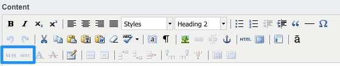
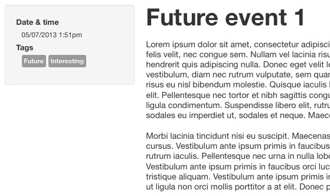
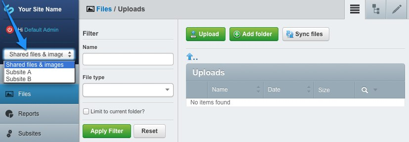
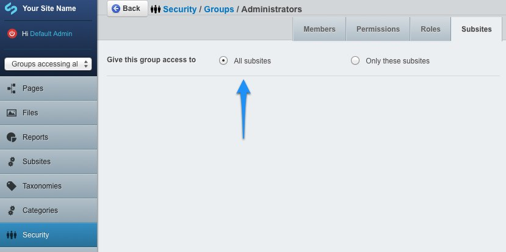

# User Howto

This howto is intended for the users of the CMS. It details all additional options provided by CWP.
For standard SilverStripe functions please refer to the [general user documentation](http://userhelp.silverstripe.org/).

## Definitions

* *Page types*: words highlighted **as follows** signify page types. These are the pages that can be created through the
*Add page* screen and include some defaults such as **Page** and **Redirector page**. See [Managing your
site](http://3.0.userhelp.silverstripe.org/for-website-content-editors/managing-your-site/) for more details.
* *Sections*: large areas of the CMS that can be navigated through the CMS menu on the left, for example *Pages* section.
* *Subsections and tabs*: these are seen on the top right of the interface and can be navigated accordingly. Some sections
will not have subsections at all - just tabs.
* *Screens*: standalone areas that perform specific functions in the CMS, such as the *Add page* screen accessible from
the *Pages* section.
* *Panels*: self-contained areas that often provide extra capabilities, for example the tree panel in the *Pages* section,
or *Filter* panel in *Files* section.

## Content editing

Most of the content on the website is edited by using the rich text editor (by default this is TinyMCE). Most of the
features of the editor are detailed in the
[content editor section](http://3.0.userhelp.silverstripe.org/for-website-content-editors/creating-and-editing-content/)
of the [SilverStripe User Help](http://3.0.userhelp.silverstripe.org/) site, however there is a small set of features
added for CWP.

### Sub- and superscript

Use the subscript and superscript buttons when you wish to add footnotes. Note that this text can also be linked,
potentially to an anchor at the bottom of the page containing the actual footnote.

### Remove formatting

Use the remove formatting button to remove formatting from the selected text. This doesn't remove structural
formatting (eg heading levels, paragraphs), only visual formatting (eg bold, italic).

### Add template

Add pre-existing templates of content by clicking on the template button. The CWP default site doesn't come with
templates, but you can ask your development agency to set up templates for you to use.

### Citation and abbreviation

The citation and abbreviation buttons work in exactly the same way but for slightly different effect. By selecting
text and then clicking on them you will be able to enter in a citation or abbreviation explanation. Type the explanation
in the "Title" field and click on "Insert" - when the user hovers over the text on the website they will get a small
popup displaying the text you entered. There will usually be an indication to the user that this information is
available, this will depend on the way your development agency has built your site.

### Insert and delete

The insertion and deletion buttons give you the capability to show to the user that certain text has been inserted or
deleted. Select the text that you wish to highlight and click the relevant button. A popup will come up that will allow
you to specify some optional parameters. Click *Update* to proceed.

To remove the insertion or deletion markup, position the cursor within the word and press the relevant editor button.
You will then be able to press the *Remove* button to remove the markup.

## Customising the site-wide title

The site-wide title can be configured through *Settings* section, *Main* subsection in the CMS - enter the title in the
*Site title* field, and press *Save*. 

This change will affect several areas in the site, but specifics depend on the template used. Default template will
display the title in the header area, in the footer copyright and in the page title.

Note: *Site Tagline/Slogan* field is not used in the default template.

## Accessibility

There are a few easy ways to add extra information to the media on your website to enable it to be accessed by people
of all abilities and disabilities. Doing so will not only increase your potential audience and not discriminate against
some of your users, but will also open up your rich video and audio content to be indexed by search engines such as
Google and Bing.

Further guidelines on accessibility can be found in [Making your web content
accessible](http://3.0.userhelp.silverstripe.org/for-website-content-editors/web-content-best-practices/#making-your-content-accessible).

### Images

When using the *Insert Media* editor button for adding or editing embedded images, it is recommended to configure the
alternative text. This is used to describe the image when the user is using a screen reader to interact with the
website. See the link above for more details.

### Video and Audio

After adding video or audio content to your site you should provide a transcript. This is a text description of the
content so that a user unable to view or listen to the media will be able to read through the content it contains.
This should be regular page content directly after the video or audio, or on a separate page linked to from near the
media.

## Setting up Google Analytics

CWP comes with an ability to configure Google Analytics via the CMS. To set it up, follow these steps:

* Find out your GA Account number, by visiting Google Analytics' website
* Open the CMS, and proceed to Settings section
* Enter the code into the `Google Analytics account` field
* Save the settings

## Setting up social media and sharing

You can add a link to your organisation's Facebook page by following these steps:

* Visit your Facebook page
* Copy the parts of the URL that appear after 'facebook.com' So, if your URL was
http://www.facebook.com/visitnewzealand, copy 'visitnewzealand'.
If it was http://www.facebook.com/profile.php?id=12635800428, then copy 'profile.php?id=12635800428'
* Open the CMS, and proceed to the Settings section
* Open the 'Social Media' tab
* Paste the copied part of the URL into the `Facebook UID or username` field
* Save the settings

In a similar way, you can add a link to your organisation's Twitter account:

* Open the CMS, and proceed to the Settings section
* Open the 'Social Media' tab
* Enter your Twitter username into the `Twitter username` field
* Save the settings

When using the default theme, these two options will add linked icons in the bottom right of each page.

You can also let your site visitors share pages on your site through their own social networks by setting up AddThis.
To do this:

* If you don't have an AddThis account already, set one up by visiting http://www.addthis.com/ and clicking on
`Create Account`.
* Open the CMS, and proceed to the Settings section
* Open the 'Social Media' tab
* Enter your AddThis profile ID into the `AddThis Profile Id` field
* Save the settings

## Customising logos

With the default CWP theme two default logos are shown:

* An organisation logo in the top left, next to the site name.
* The newzealand.govt.nz logo in the bottom right.

These can be changed as follows:

* Open the CMS, and proceed to the *Settings* section, *Logos/Icons* tab.
* Customise the organisation logo by attaching an image to the *Logo, to appear in the top left.*
* Replace the "newzealand.govt.nz" logo by attaching an image to the *Footer logo, to appear in the bottom right.*
  * Set a custom link by filling the *Footer Logo link* field.
  * Set an accessibility description (that will propagate to "title" and "alt" attributes) by filling the *Footer Logo
  description* field.
* Press *Save*.

The logos aren't automatically resized, so make sure they are exactly the size you'd like them to appear before
uploading them.

## Customising favicon and Apple Touch Web Clip icons

With the default CWP theme, icons in `themes/default/ico` are used by default to display the favicon and Apple Touch
Web Clip icons, the latter are used when you bookmark the website to the home screen of an iOS device.

These can be changed as follows:

 * Open the CMS and proceed to the *Settings* section, *Logos/Icons* tab
 * Find the fields for favicon and Apple Touch and drop in new images for each
 * Press *Save*

Please ensure the favicon.ico file you upload is either 16x16, 32x32 or 48x48 in dimension and is in a Windows
compatible ICO format.

Apple Touch Web Clip icons *must* be uploaded in the correct dimensions as per the label next to each field,
and they must be in PNG format.

## Embedding iframes

An iframe page type is bundled for easy embedding of external resources. It has the following settings:

* URL: this is a resource URL to be included into the page. If you want the height autosetting to work, the supplied URL
needs to be either relative, or at least match the name of your site's domain.
* Auto height: the client browser will attempt to set the height of the iframe automatically to match the height of the
target content. This does not mean that the iframe will resize dynamically to respond to content changes.
* Auto width: the client browser will fill the available horizontal space. This is not tied in any way to the iframe
content.
* Fixed height: explicit size, used also as a fallback if autosetting fails.
* Fixed width: explicit size.

On top of that, three content areas are supplied:

* Content above the iframe
* Content below the iframe
* Alternate content: used if the client browser does not support iframes, or refuses to handle them.

*Caveats:* When setting the sizes, check under different browsers if everything fits correctly. Also, the autosetting
is one-off only. The scrollbars will appear if the content of the iframed page changes dynamically, for example when
expanding menus or showing other animations. The recommended approach is to disable automatic height.

## Adding links to your footer

Locate the pages for which you require footer links beneath the **Footer Holder**. The holder may need to be created at
the top level of your site tree if it does not already exist.

Ensure that the *URL Segment* of the **Footer Holder** is concise as the text in this field will show within the footer
page links.

If you have a page elsewhere on your site that you require footer links for but you do not wish to move this page to
under the **Footer Holder**, you can create a **Redirector Page** which links to that page.

## Adding taxonomy terms to a page

Documentation on managing taxonomy terms is [available in the taxonomies module](../../taxonomy).

Taxonomy terms previously created in the Taxonomy section of the CMS can be added to pages from the *Tags* tab.
Type the first few characters of the desired term into the search field and select the term from the search
results displayed below the search field. Click the *Link Existing* button to add the term to the page and save
when all desired terms have been added.

The terms can only be linked and unlinked from the page from this tab - the taxonomy data and structure
cannot be changed through this interface. See the module documentation for information on how to build the taxonomy.

## Linking related pages

Other pages can be marked as related to a page from the *Related Pages* tab. A website visitor can view a list of
these related pages on the page. Start typing the page name in the search field as shown below and search results
will appear in a dropdown. Select the page name and click the *Link Existing* button to link it as a related page.

Check "Allow Drag and Drop" to allow dragging the rows up and down which affect the order these related
pages appear on the website.

## Events

The CWP module allows you to create events (**Event Pages**) and event listings (**Event Holders**).

Specialised pages can be created to allow website visitors to view individual events (**Event Pages**) and event
listings (**Event Holders**).

To create a page to display information for an event, add a new page of the type **Event Page**. In addition to the
fields available on other pages, this page type allows you to specify the date and time of the event. These
details will be displayed on the template along with any taxonomy terms you associate with the page (see "Adding
taxonomy terms to a page" above).

The events must be listed in a structured way to allow visitors to easily browse them. This is acheived with an **Event
Holder** which contains the **Event Pages**. Any number of **Event Holders** can be created, each with its own set of
events.

The events listing for the above events holder and pages is shown below and includes the following features:

* Events are sorted by date, descending (most recent on the top).
* Sidebar shows the taxonomy terms associated with underlying events.
* Months (and years) for which events are scheduled can be navigated.

## Sharing assets between subsites

*Subsites* module allows creation of multiple topical sites under the umbrella of a single CMS. Assets can be associated
with a specific subsite, in which case they will only be available to that subsite. Files can also be unassociated, in
which case they will be treated as a shared asset - anybody who has access to any of the subsites will be able to use
these.

Whenever you upload files to the "Main site" they will be treated as shared asset. Before uploading make sure the
subsite selection dropdown at the top left is set to "Shared files & images".

To be able to access the "Shared files & images" you need to have the "All subsites" permission assigned through the
*Security* section.

